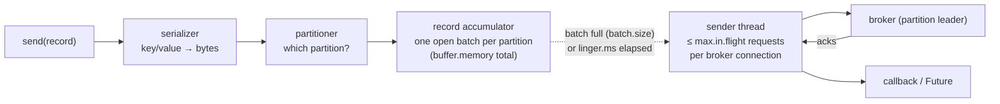

# 01 · Producer anatomy, defaults and metrics

**Demo:** `producer-baseline` · [ProducerBaselineDemo.java](../plain-clients/src/main/java/io/kafkatweaks/producer/ProducerBaselineDemo.java) · **Recipe:** [ProducerBasics.java](../plain-clients/src/main/java/io/kafkatweaks/producer/recipe/ProducerBasics.java)

Before tuning anything, know what happens between `send()` and the callback, what the defaults are, and where
the numbers come from. Every later producer chapter changes one group of knobs and compares against this run.

## The send path



- `send()` is **asynchronous**: it returns as soon as the record sits in the accumulator. Only `max.block.ms`
  can make it block (waiting for metadata or for buffer space).
- The **sender thread** drains batches. One produce request carries up to one batch per partition led by that broker.
- With `acks=all` (the default) the broker replies once every in-sync replica has the batch.
- **A synchronous `send().get()` per record** serialises all of that: throughput becomes `1000 / round-trip-ms` records per second.

## Kafka 4.x defaults worth knowing

| Config | 4.x default | Note |
|---|---|---|
| `acks` | `all` (`-1`) | since 3.0 |
| `enable.idempotence` | `true` | since 3.0; requires `acks=all` and `max.in.flight ≤ 5`, and now refuses to silently fall back |
| `linger.ms` | **5** | was 0 before 4.0; batches now wait 5 ms for company by default |
| `batch.size` | 16384 | bytes, per partition batch, **before** compression |
| `compression.type` | `none` | |
| `buffer.memory` | 32 MB | total accumulator |
| `max.block.ms` | 60000 | |
| `delivery.timeout.ms` / `request.timeout.ms` | 120000 / 30000 | |
| `partitioner.class` | `null` = built-in sticky partitioner | `DefaultPartitioner`/`UniformStickyPartitioner` classes were **removed** in 4.0 |
| `metadata.recovery.strategy` | `rebootstrap` | client re-reads `bootstrap.servers` when all known brokers are gone |

## The code that matters

Nothing is tuned in this chapter on purpose: the 4.x defaults are the safe ones. What matters is how `send()` is
called. From [ProducerBasics.java](../plain-clients/src/main/java/io/kafkatweaks/producer/recipe/ProducerBasics.java):

<!-- recipe: plain-clients/src/main/java/io/kafkatweaks/producer/recipe/ProducerBasics.java -->
```java
public static <K, V> void send(Producer<K, V> producer, ProducerRecord<K, V> record, Consumer<Exception> onFailure) {
    producer.send(record, (metadata, exception) -> {
        if (exception != null) {
            onFailure.accept(exception);   // the only place a failed send shows up: log it, count it, park the record
        }
    });
}
```

- **Asynchronous with a callback** is what pushed 5 883 records/s from one thread in the run below. The same
  record through `ProducerBasics.sendAndWait` (`send().get()`) waits a full round trip, ~15 ms here, every time.
- **The callback is where failures show up.** `send()` returns long before the broker answers; a record that
  fails for good completes its callback (and future) with the exception.
- **Name every producer.** `ProducerBasics.config(bootstrap, clientId)` sets `client.id`, the tag on every
  metric in the tables below.

The demo builds its producer with `ProducerBasics.config(...)` and times `ProducerBasics.sendAndWait` in step 2;
everything else in [ProducerBaselineDemo.java](../plain-clients/src/main/java/io/kafkatweaks/producer/ProducerBaselineDemo.java)
is measurement.

## Run it

```bash
./mvnw -q -pl plain-clients -am compile exec:java -Dexec.args="producer-baseline"
```

Arguments: `records=20000`, `size=512` (bytes of order-like JSON per record), `topic=tweaks.baseline`.

## What you should see

1. A knobs table: this run against the client defaults (identical here, by design).
2. Two synchronous sends. The first one is slow (metadata fetch, connection setup); the second one is the
   real round trip, ~15 ms on this Docker stack.
3. The asynchronous workload:

```
| run      | records | payload MB | elapsed ms | records/s | MB/s | ack p50 ms | ack p99 ms | ack max ms | errors |
| baseline |   20.0K |      10.91 |       3400 |      5883 | 3.21 |       1625 |       2838 |       2868 |      0 |
```

   Records spread evenly over the 3 partitions (sticky partitioner, null keys).

4. The producer's own metrics for that run:

```
| record-send-rate          |   599 | records/s the sender thread pushed out     |
| batch-size-avg            | 16.0K | bytes per batch actually sent (compressed) |
| records-per-request-avg   | 27.47 | records per produce request                |
| compression-rate-avg      |     1 | compressed/uncompressed; 1.0 = none        |
| request-latency-avg       | 67.23 | ms from request out to broker response     |
| record-queue-time-avg     |  1561 | ms a record waited in the accumulator      |
```

Your absolute numbers will differ; the shape will not.

## Reading the numbers

**Why is p50 ack latency 1.6 s when the broker answers in 67 ms?** Because the loop hands records to the
accumulator far faster than the sender can drain them, and every record queues behind full batches. The
producer's ceiling here is

```
throughput ≈ brokers × max.in.flight × batch.size / request-latency
           ≈ 3 × 5 × 16 KB / 0.067 s ≈ 3.6 MB/s
```

which is exactly the 3.2 MB/s measured. `record-queue-time-avg` (1561 ms) is the symptom; the cures are the
whole of chapter 02: bigger batches, compression, or more partitions/brokers.

**Why does `record-send-rate` say 599 when we measured 5883 records/s?** Kafka's rate metrics are computed
over a window of at least `metrics.sample.window.ms × (metrics.num.samples − 1)` = 30 s. A 3.4 s run is
divided by 30 s. In a long-running service the metric is right; in a short benchmark trust the elapsed-time
figure. `*-total` counters are always exact.

**Metrics are per producer instance.** A fresh producer reports `NaN`/0 (shown in the demo). Give every
producer a meaningful `client.id`: it becomes the `client-id` tag on every metric and appears in broker logs
and quotas.

## When to touch what

| You want | Start with | Chapter |
|---|---|---|
| more records/s or MB/s | `linger.ms`, `batch.size`, `compression.type` | 02 |
| never lose an acknowledged record | `acks=all`, `min.insync.replicas`, idempotence | 03 |
| control which partition gets what | keys, `partitioner.*`, custom partitioner | 04 |
| lowest possible latency | `linger.ms=0`, small batches, no compression | 05 |
| atomic writes across partitions, or exactly-once consume-transform-produce | `transactional.id` | 06 |
