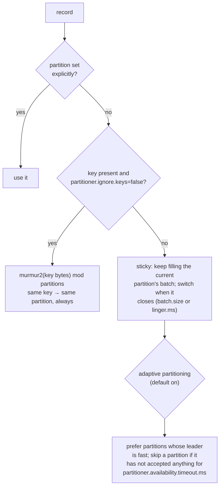

# 04 · Partitioning and keys

**Demo:** `producer-partitioning` · [ProducerPartitioningDemo.java](../plain-clients/src/main/java/io/kafkatweaks/producer/ProducerPartitioningDemo.java)

## The problem

The partition a record lands on decides three things: which consumer will process it, in what order
relative to other records, and how well it batches on the way out. The producer decides all of that
before the record leaves the JVM.

## How the built-in partitioner decides (Kafka 4.x)



| Config | Default | Meaning |
|---|---|---|
| `partitioner.class` | `null` = built-in | `RoundRobinPartitioner` is the only other shipped one; `DefaultPartitioner` and `UniformStickyPartitioner` were **removed in 4.0** |
| `partitioner.ignore.keys` | `false` | `true` = treat every record as key-less for partitioning (sticky). Ordering per key is gone |
| `partitioner.adaptive.partitioning.enable` | `true` | for key-less records, weight partitions by how fast their leader accepts batches |
| `partitioner.availability.timeout.ms` | 0 (off) | stop sending key-less records to a partition that has not made progress for this long |

## Run it

```bash
./mvnw -q -pl plain-clients -am compile exec:java -Dexec.args="producer-partitioning"
```

Arguments: `records=30000`, `size=256`, `rate=3000`, `keys=20`, `hot=50`.

## What you should see

**1. Key-less records at a steady 3 000 records/s**, sticky vs round-robin. Same throughput by
construction (the load is paced), very different batches:

```
| run              | batch-size-avg | records-per-request-avg | request-latency-avg | request-rate |
| sticky (default) |          11.2K |                   65.40 |               22.56 |         9.78 |
| round-robin      |           2847 |                   64.34 |               12.72 |         9.94 |
```

**2. Keyed records.** 20 keys over 6 partitions is not a uniform spread, and one hot key is one hot
partition:

```
hash of 20 keys                         hot key: 50% of records share one key
| partition | records | share |         | partition | records | share |
|         0 |    4500 | 15.0% |         |         0 |    2400 |  8.0% |
|         1 |   10.5K | 35.0% |         |         1 |   20.1K | 67.0% |
|         2 |    6000 | 20.0% |         |         2 |    3000 | 10.0% |
|         3 |    3000 | 10.0% |         |         3 |    1500 |  5.0% |
|         4 |    4500 | 15.0% |         |         4 |    2400 |  8.0% |
|         5 |    1500 |  5.0% |         |         5 |     600 |  2.0% |
distinct keys: 20, keys that landed on more than one partition: 0
```

With `partitioner.ignore.keys=true` the same keyed records spread evenly, and **all 20 keys land on
more than one partition**: per-key ordering is gone.

**3. A custom `Partitioner`** (`TenantPartitioner` in the demo) sends `vip-*` keys to partition 0 and
hashes everyone else over partitions 1–5.

## Reading the numbers

- **Sticky batches are 4× bigger at the same rate.** Round-robin spreads each linger window over 6
  partitions, so each batch holds a sixth of the records; the broker receives 6 small batches per request
  instead of one or two large ones. Under a firehose (chapter 02) both fill `batch.size` and the difference
  disappears; under steady, moderate traffic the sticky partitioner is why 4.x batches well by default.
- **`records-per-request-avg` was the same (~65)** because both send one request per broker per linger
  window; what changed is how those records were split into per-partition batches inside the request,
  which is what the broker writes and replicates one by one.
- **Key hashing is deterministic, not fair.** murmur2 does its job (same key → same partition, 0 keys
  moved); fairness needs many more keys than partitions. With 20 keys the spread is 5–35 %; a hot key
  dominates its partition and the single consumer that owns it. Fixes are in the key design (a finer
  key, or a salted key when order across the salt does not matter), not in Kafka configuration.
- **Changing the partition count re-maps every key.** `hash mod 6` and `hash mod 12` disagree. Add
  partitions only when per-key ordering across the change does not matter, or route old and new data by
  time.
- **A custom partitioner is a routing policy in the producer.** Handy (dedicated partition for a tenant,
  geo-affinity), but every producer of the topic must agree on it, forever. Prefer keys.

## When to use what

| You need | Do |
|---|---|
| order per entity (order id, account, device) | key by that id; leave the partitioner alone |
| maximum batching for key-less events | leave the defaults (sticky + adaptive) |
| a key you need downstream, but not for ordering | `partitioner.ignore.keys=true`, or put the id in the value/header and send key-less |
| a hot key | split it: `key + "-" + shard` when order across shards is irrelevant, or a bigger partition count *and* more consumers |
| a slow broker dragging producer latency | `partitioner.availability.timeout.ms=` a few hundred ms (key-less records only) |
| strict equal distribution regardless of batching | `RoundRobinPartitioner`, knowing it costs batch efficiency |
