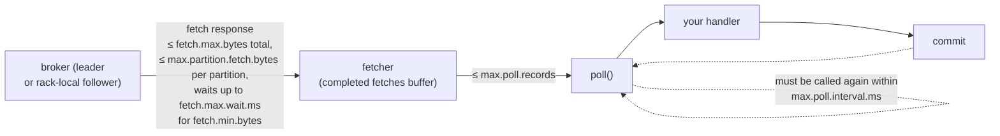

# 07 · The poll loop and fetch tuning

**Demo:** `consumer-fetch` · [ConsumerFetchDemo.java](../plain-clients/src/main/java/io/kafkatweaks/consumer/ConsumerFetchDemo.java) · **Recipe:** [FetchTuning.java](../plain-clients/src/main/java/io/kafkatweaks/consumer/recipe/FetchTuning.java)

## The problem

A consumer is a loop: `poll()`, process, commit, repeat. Two machines feed it. A background **fetcher**
asks brokers for data ahead of time, in requests shaped by the `fetch.*` settings; `poll()` then hands the
application a slice of what the fetcher buffered, capped by `max.poll.records`. Tuning means understanding
which of the two you are changing, and never forgetting that the loop itself has a deadline.



## The knobs

| Config | Default | Machine | Meaning |
|---|---|---|---|
| `max.poll.records` | 500 | poll | max records one `poll()` returns. Shapes the handler's batch and how long a poll iteration takes |
| `max.poll.interval.ms` | 300000 | poll | deadline between two `poll()` calls; miss it and the consumer leaves the group |
| `fetch.min.bytes` | 1 | fetch | broker waits until this much data is available before answering |
| `fetch.max.wait.ms` | 500 | fetch | ...but never longer than this |
| `fetch.max.bytes` | 50 MB | fetch | max size of one fetch response (soft: the first batch is always returned) |
| `max.partition.fetch.bytes` | 1 MB | fetch | max data per partition per response (soft, same rule). Memory ≈ partitions × this |
| `receive.buffer.bytes` | 64 KB | socket | TCP receive buffer; `-1` = OS default, worth raising across high-latency links |
| `enable.auto.commit` | `true` | commit | chapter 08 |

A detail that decides more than most settings: **the broker never re-batches.** A fetch returns the record
batches the producer wrote, whole. Producer `batch.size`/`compression.type` (chapter 02) therefore also
decide how many records a consumer gets per fetch.

## The code that matters

Three situations, three maps, from [FetchTuning.java](../plain-clients/src/main/java/io/kafkatweaks/consumer/recipe/FetchTuning.java):

<!-- recipe: plain-clients/src/main/java/io/kafkatweaks/consumer/recipe/FetchTuning.java -->
```java
public static Map<String, Object> catchUp() {
    return Map.of(
            // Records per poll(), default 500. Only the size of the handler's batch: 50 or 500 made no difference
            // to throughput, because the fetcher runs ahead of poll() either way.
            ConsumerConfig.MAX_POLL_RECORDS_CONFIG, 5000,
            // Data per partition per fetch response, default 1 MB. This is what moves throughput: 64 KB halved it.
            ConsumerConfig.MAX_PARTITION_FETCH_BYTES_CONFIG, 4 * 1024 * 1024,
            // The broker holds the fetch until this much data is available, default 1 byte ...
            ConsumerConfig.FETCH_MIN_BYTES_CONFIG, 1024 * 1024,
            // ... but never longer than this, default 500 ms.
            ConsumerConfig.FETCH_MAX_WAIT_MS_CONFIG, 500);
}

public static Map<String, Object> fewerFetches(int minBytes, Duration maxWait) {
    // ...
}

public static Map<String, Object> pollBudget(int maxPollRecords, Duration maxPollInterval) {
    return Map.of(
            ConsumerConfig.MAX_POLL_RECORDS_CONFIG, maxPollRecords,
            ConsumerConfig.MAX_POLL_INTERVAL_MS_CONFIG, (int) maxPollInterval.toMillis());
}
```

- **`catchUp()`** is the `big-everything` row: 120.4K records/s with 3.5 MB fetches, against 92.0K for the defaults.
  Memory is the price: a consumer may buffer partitions × 4 MB.
- **`fewerFetches(64 * 1024, Duration.ofSeconds(2))`** turned 35 fetches/s of 1 record into 0.33 fetches/s of 94 while
  tailing a trickle, for up to 2 s of added latency.
- **`pollBudget(100, ...)`** kept the 10 ms/record handler inside a 3 s `max.poll.interval.ms`; 500 records per poll
  got the consumer kicked out of the group (`CommitFailedException`).
- **Every `poll()` result counts**: never call `poll()` only to "wait for the assignment" and drop what it returned.

The demo's `PRESETS` and its slow-handler and tailing runs apply these maps; everything else in
[ConsumerFetchDemo.java](../plain-clients/src/main/java/io/kafkatweaks/consumer/ConsumerFetchDemo.java) is measurement.

## Run it

```bash
./mvnw -q -pl plain-clients -am compile exec:java -Dexec.args="consumer-fetch"
```

Arguments: `records=150000`, `size=512`, `runs=defaults,big-everything` (preset names as written in the source; no
spaces or commas in them, so they survive `-Dexec.args`).

## What you should see

**1. Catching up** on 150 000 × 512-byte records (written with producer defaults: 16 KB batches, no
compression), a fresh group per preset:

```
| preset                        | elapsed ms | records/s | MB/s  | polls | records/poll | fetch-size-avg | records/fetch | fetch-latency-avg | fetch-rate |
| defaults                      |       1631 |     92.0K | 48.29 |   333 |          450 |         987.0K |          1730 |             49.34 |       2.75 |
| max.poll.records=50           |       1649 |     91.0K | 47.78 |  3037 |        49.39 |         984.0K |          1725 |             48.79 |       2.75 |
| max.poll.records=5000         |       2031 |     73.8K | 38.78 |    84 |         1786 |         984.2K |          1725 |             63.26 |       2.75 |
| max.partition.fetch.bytes=64K |       2822 |     53.2K | 27.91 |  1291 |          116 |          64.2K |           113 |              5.66 |      40.67 |
| fetch.min.bytes=1M+wait=500   |       1499 |    100.0K | 52.54 |   331 |          453 |         987.0K |          1730 |             47.10 |       2.76 |
| big-everything                |       1246 |    120.4K | 63.20 |    41 |         3659 |          3.54M |          6200 |               141 |       0.80 |
```

**2. The slow handler**, 10 ms per record, `max.poll.interval.ms=3000`:

```
| max.poll.records | max.poll.interval.ms | ms per record | outcome                                                                                                       |
|              500 |                 3000 |            10 | CommitFailedException after 500 records: Offset commit cannot be completed since the consumer is not part of an active group ... it is likely that the consumer was kicked out of the group. |
|              100 |                 3000 |            10 | processed 300 records in 3 polls, every commit succeeded                                                      |
```

**3. Tailing a trickle** of ~200 records/s for 8 s:

```
| fetch.min.bytes | fetch.max.wait.ms | records | polls | non-empty polls | records/fetch | fetch-latency-avg ms | fetch-rate /s |
|               1 |               500 |    1381 |  1323 |            1323 |          1.04 |                17.19 |         35.42 |
|           65.5K |              2000 |    1126 |    87 |               9 |         93.83 |                 1921 |          0.33 |
```

(Run-to-run variance on a laptop is ±20 %; the shape holds, individual rows swap places.)

## Reading the numbers

- **`max.poll.records` is about the handler, not the network.** 50 or 500 records per poll: same
  throughput, same fetch sizes (rows 1–2); the fetcher buffers ahead regardless and a poll is just a
  slice of that buffer. Use it to bound how long one iteration takes (`records × time-per-record`),
  which is what keeps you inside `max.poll.interval.ms`.
- **Fetch size is what moves throughput.** `max.partition.fetch.bytes=64K` (row 4) makes fetches 15×
  smaller and the fetch rate 15× higher; every request pays a broker round trip and throughput halves.
  "Big everything" (row 6) goes the other way: 3.5 MB per fetch, 0.8 fetches/s, the best catch-up rate.
  Lower the per-partition limit only to cap memory (`partitions × max.partition.fetch.bytes` is what a
  consumer may hold) or to interleave partitions (chapter 10).
- **`fetch.min.bytes` + `fetch.max.wait.ms` are for low traffic**, and they show two faces. Catching up on
  a backlog, they change little except at the very end, where the last fetches wait `fetch.max.wait.ms`
  for bytes that never come. Tailing a trickle, they turn a fetch per record into a fetch per
  `fetch.max.wait.ms`, at the cost of exactly that much latency: pick the wait you can afford.
- **The slow handler is kicked out, not slowed down.** Overrun `max.poll.interval.ms` and the consumer
  itself leaves the group ("consumer poll timeout has expired"), its partitions move, and the next commit
  fails with `CommitFailedException`; the batch is redelivered to someone else. Three fixes, in order of
  preference: lower `max.poll.records`, raise `max.poll.interval.ms` to an honest budget, or move the work
  off the poll thread (chapter 10).
- **Metrics to watch**: `records-lag-max` (are we keeping up), `fetch-latency-avg` (broker round trip or
  `fetch.max.wait.ms` when idle), `fetch-size-avg` and `records-per-request-avg` (how full fetches are),
  `time-between-poll-avg` vs `max.poll.interval.ms` (how close to being kicked out).
- **Every `poll()` result counts.** A common bug: a loop that calls `poll()` just to "wait for the
  assignment" and ignores what it returns. The poll that completes the group join can already carry
  records; dropping them moves the position past them, and the next commit declares them processed. The
  transactions demo of chapter 06 had exactly this bug in an early version and lost a batch per restart.

## When to use what

| Situation | Setting |
|---|---|
| handler takes milliseconds per record | `max.poll.records` such that a full poll fits comfortably in `max.poll.interval.ms`; commit per poll |
| high-volume stream, want fewer round trips | raise `max.partition.fetch.bytes` / `fetch.max.bytes`; ask producers to batch and compress |
| low-volume stream, CPU on the broker matters | `fetch.min.bytes=64K–1M` with `fetch.max.wait.ms` = the latency you accept |
| consumer with many partitions, tight memory | lower `max.partition.fetch.bytes` (memory ≈ partitions × this), accept more fetch requests |
| poll timeouts in the logs | shrink the batch (`max.poll.records`), then measure; do not just raise `max.poll.interval.ms` to an hour |
| WAN or high-latency link | `receive.buffer.bytes=-1` (OS autotuning) or a few MB |
