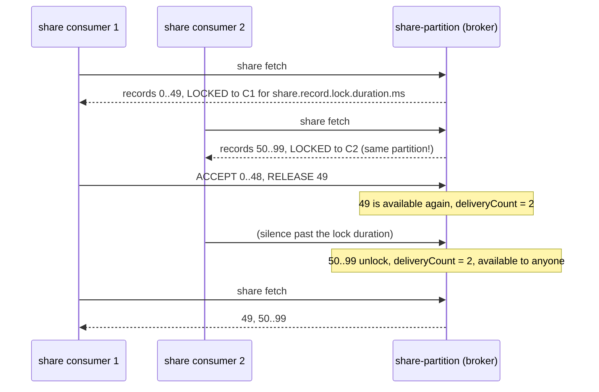

# 11 · Queues for Kafka: share groups

**Demo:** `consumer-share` · [ConsumerShareDemo.java](../plain-clients/src/main/java/io/kafkatweaks/consumer/ConsumerShareDemo.java) · **Recipe:** [ShareWorker.java](../plain-clients/src/main/java/io/kafkatweaks/consumer/recipe/ShareWorker.java)

## The problem

Consumer groups give every partition to exactly one member, in order. That is the right model for
event streams and the wrong one for a work queue: the number of parallel workers is capped by the
partition count, one slow record blocks everything behind it in its partition, and "retry this one
record later" or "dead-letter this one" have no natural expression (chapter 08's tools are seeking and
committing offsets, which operate on *positions*, not records).

**Share groups** (KIP-932, "Queues for Kafka", production-ready since Kafka 4.2) are a second way to
consume the same topics: records, not partitions, are handed out; each record is acknowledged
individually; the broker tracks delivery counts and re-delivers what was released or left unacknowledged.

## How it works



| Concept | Consumer group | Share group |
|---|---|---|
| unit of work | partition | record |
| state | committed offset per partition | per-record state: available / acquired / acknowledged / archived, plus delivery count |
| parallelism | ≤ partitions | any number of members, all reading every partition |
| ordering | per partition | none across members |
| retry | seek back (replays everything after) | `RELEASE` one record |
| poison record | skip by seeking past it | `REJECT` it; or it hits `share.delivery.count.limit` and is archived |
| replay | seek to offset/time | `kafka-share-groups.sh --reset-offsets` (start position), not per record |
| client class | `KafkaConsumer` | `KafkaShareConsumer` |

## The knobs

| Config | Where | Default | Meaning |
|---|---|---|---|
| `share.acknowledgement.mode` | consumer | `implicit` | `implicit`: everything from a poll is ACCEPTed on the next poll/commit. `explicit`: you call `acknowledge(record, type)` for each record |
| `share.acquire.mode` | consumer | `batch_optimized` | `record_limit` makes `max.poll.records` strict (KIP-1206) |
| `max.poll.records` | consumer | 500 | how many records to acquire per poll |
| `share.auto.offset.reset` | **group** | `latest` | where a *new* share group starts: `earliest` or `latest` |
| `share.record.lock.duration.ms` | **group** | 30000 | how long an acquired record is locked to the consumer that fetched it (broker bounds: `group.share.min/max.record.lock.duration.ms`, 15 s / 60 s by default; this stack lowers the minimum to 2 s) |
| `share.delivery.count.limit` | **group** | 5 | after this many deliveries a record is archived (never delivered again) |
| `share.isolation.level` | **group** | `read_uncommitted` | |
| `AcknowledgeType` | API | – | `ACCEPT` done · `RELEASE` redeliver · `REJECT` archive · `RENEW` extend the lock (KIP-1222) |

Group-level configs are set with `kafka-configs --entity-type groups --entity-name <group> --alter --add-config ...`
or `Admin.incrementalAlterConfigs` on a `ConfigResource.Type.GROUP`, as the demo does.

## The code that matters

A `KafkaShareConsumer` with `ShareWorker.explicitAcks()`, the group settings set once, and a loop that decides per
record. From [ShareWorker.java](../plain-clients/src/main/java/io/kafkatweaks/consumer/recipe/ShareWorker.java):

<!-- recipe: plain-clients/src/main/java/io/kafkatweaks/consumer/recipe/ShareWorker.java -->
```java
public static Map<String, String> groupSettings(String autoOffsetReset, Duration lockDuration, int deliveryLimit) {
    return Map.of(
            "share.auto.offset.reset", autoOffsetReset,
            "share.record.lock.duration.ms", String.valueOf(lockDuration.toMillis()),
            "share.delivery.count.limit", String.valueOf(deliveryLimit));
}
// ...
public int pollOnce(Duration timeout) {
    ConsumerRecords<K, V> batch = consumer.poll(timeout);
    if (batch.isEmpty()) {
        return 0;
    }
    for (ConsumerRecord<K, V> record : batch) {
        AcknowledgeType outcome;
        try {
            outcome = decider.decide(record);   // record.deliveryCount() says how many times it was delivered before
        } catch (Exception e) {
            outcome = AcknowledgeType.RELEASE;   // retry; after share.delivery.count.limit deliveries it is archived
        }
        consumer.acknowledge(record, outcome);
    }
    // Sends the acknowledgements and reports the outcome per partition; an error means those acks were not applied.
    consumer.commitSync().forEach((partition, error) -> error.ifPresent(e -> onCommitError.accept(partition, e)));
    return batch.count();
}
```

- **The decider is the whole queue policy**: `ACCEPT` done, `RELEASE` try again (any member, `deliveryCount` + 1),
  `REJECT` never again. With every 50th record rejected and every 7th released once: 2 940 accepted + 60 rejected =
  3 000, and the 420 released ones came back with `deliveryCount` 2.
- **The group settings are not client configs.** `ShareWorker.configureGroup(admin, group, groupSettings(...))` sets
  them with `Admin.incrementalAlterConfigs` on the GROUP, like `kafka-configs --entity-type groups`.
- **Size `share.record.lock.duration.ms` above your slowest honest handler**: part 3 shows what happens to a consumer
  that goes silent (its records go to the others with `deliveryCount` 2).
- Implicit mode (part 1) is the easy path: the next `poll()` or `commitSync()` ACCEPTs everything; commit the last
  poll before closing, or those records come back to someone else after the lock expires.

The demo's explicit part runs through `ShareWorker` with its scripted policy as the decider; the implicit and lock
parts use the consumer directly. Everything else in
[ConsumerShareDemo.java](../plain-clients/src/main/java/io/kafkatweaks/consumer/ConsumerShareDemo.java) is measurement.

## Run it

```bash
./mvnw -q -pl plain-clients -am compile exec:java -Dexec.args="consumer-share"
```

Arguments: `records=3000`, `consumers=4`.

## What you should see

**1. Four share consumers, three partitions, implicit acknowledgement**, 3 000 records:

```
share group queue-94800: state Stable
| member (client.id) | assigned partitions |
| queue-share-1      |                 0,1 |
| queue-share-2      |                   0 |
| queue-share-3      |                 1,2 |
| queue-share-0      |                   2 |

| consumer | records received | from partitions                                   |
| share-0  |              422 |                                                 2 |
| share-1  |              993 |                                               0,1 |
| share-2  |              528 |                                                 0 |
| share-3  |             1057 |                                               1,2 |
| total    |             3000 | distinct records 3000, delivered more than once 0 |
```

**2. Explicit acknowledgement**, every 50th key rejected as poison, every 7th key released once:

```
| input records | accepted | released (retried) | rejected (poison) | records seen with deliveryCount > 1 | max deliveryCount |
|          3000 |     2940 |                420 |                60 |                                 420 |                 2 |
```

`accepted + rejected = input`: every record reached exactly one final state; the 420 released ones came
back (delivery count 2) and were accepted the second time.

**3. Acquisition locks**, on a one-partition topic with a 2 s lock:

```
A acquired 60 records and stops responding for 3 s...
B received 60 of A's records again (deliveryCount 2) plus 0 fresh ones
A's late acknowledgement for ...:tweaks.queue-locks-0: refused with InvalidRecordStateException (The record state is invalid. ...)
```

(Depending on timing the late acknowledgement is either refused with `InvalidRecordStateException` or
reported without error because it changed nothing; B had already decided those records' fate.)

## Reading the numbers

- **Four consumers on three partitions all got work.** In a consumer group the fourth would sit idle.
  Note how the assignor spreads members over partitions: every partition has at least one member and
  members share partitions (two members each on partition 0, 1 and 2 above), but a member does not
  necessarily see every partition. Within a partition the broker hands out disjoint slices of records to
  its members, which is why the distribution is uneven and why there are no duplicates.
- **Implicit mode is the easy path**, and the last poll before shutdown must be committed (`commitSync()`)
  or those records come back to someone else after the lock expires. Not a bug: it is the queue keeping
  its promise that acquired-but-unacknowledged work is not lost.
- **Explicit mode is where queues earn their keep.** `RELEASE` is a per-record retry with a delivery
  counter (`ConsumerRecord.deliveryCount()`), `REJECT` a per-record dead letter. Together with
  `share.delivery.count.limit` you get "retry N times, then give up" without a retry topic.
- **The lock is the liveness guarantee.** A consumer that acquires records and dies (or blocks) holds
  them only for `share.record.lock.duration.ms`; then they are available again, with the delivery count
  bumped. Size the lock above your slowest honest handler, or `RENEW` it from long-running work. A late
  acknowledgement after the lock expired is refused.
- **No ordering across members**, by design. Two records of the same key may be processed concurrently by
  different members. If that matters, it is not a queue workload.
- **Share groups coexist with consumer groups** on the same topic: a share group is just another
  reader with its own state. Nothing changes for producers.

## When to use what

| Workload | Use |
|---|---|
| independent jobs, uneven processing time, "as many workers as I want" | share group, `explicit` acknowledgement |
| per-key ordering or a stream to replay by offset | consumer group |
| retry-with-backoff and dead-letter semantics without retry topics | share group: `RELEASE` + `share.delivery.count.limit`, `REJECT` for poison |
| long-running handlers | `share.record.lock.duration.ms` ≥ worst case, or `AcknowledgeType.RENEW` |
| Spring | spring-kafka 4.x: `@KafkaListener` on a share consumer container factory, `ShareAckMode` |
