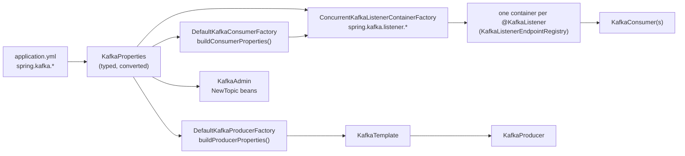

# 14 · Spring Boot wiring and the `spring.kafka.*` mapping

> **Level:** Essentials · **Read first:** [01](01-producer-baseline.md), [07](07-consumer-fetch.md) · **Time:** ~10 min read, ~1 min run · [Glossary](glossary.md)
>
> **Demo:** `spring-setup` (`./demo 14`) · [SetupDemo.java](../spring-boot-kafka/src/main/java/io/kafkatweaks/spring/setup/SetupDemo.java) · **Recipe:** [application-spring-setup.yml](../spring-boot-kafka/src/main/resources/application-spring-setup.yml), [TopicsConfig.java](../spring-boot-kafka/src/main/java/io/kafkatweaks/spring/TopicsConfig.java) · **Plain-client version:** chapters [01](01-producer-baseline.md)–[13](13-avro-schema-registry.md)
>
> **In one sentence:** How Boot turns `spring.kafka.*` into the producer, consumer and admin configs of part 1: typed keys are converted (`64KB` became `65536`), the rest passes through `properties[...]`, and your own beans replace Boot's.

## The problem

Part 1 tuned `KafkaProducer` and `KafkaConsumer` directly. In a Spring Boot service nobody constructs them:
Boot builds a `ProducerFactory`, a `ConsumerFactory`, a `KafkaTemplate`, a `KafkaAdmin` and a listener
container factory from `spring.kafka.*`, and `@KafkaListener` methods get their consumers from the factory.
Every knob of chapters 01–13 still exists, but it now has a Spring spelling, a type (`64KB`, `250ms`),
a precedence, and sometimes a Spring-level twin that matters more (the container's `AckMode` instead of
`enable.auto.commit`). This chapter is the map; the chapters after it use the machinery.



## What Boot auto-configures

| Bean | Condition | Configured from |
|---|---|---|
| `DefaultKafkaProducerFactory` | no `ProducerFactory` bean of yours | `spring.kafka.producer.*`, `transaction-id-prefix` |
| `DefaultKafkaConsumerFactory` | no `ConsumerFactory` bean | `spring.kafka.consumer.*` |
| `KafkaTemplate` | no `KafkaTemplate` bean (**any** template bean you add switches the default off) | `spring.kafka.template.*` |
| `LoggingProducerListener` | no `ProducerListener` bean | logs send failures |
| `KafkaAdmin` | no `KafkaAdmin` bean | `spring.kafka.admin.*`; creates every `NewTopic` bean at startup |
| `ConcurrentKafkaListenerContainerFactory` (`kafkaListenerContainerFactory`) | no bean of that name | `spring.kafka.listener.*`, plus your optional `CommonErrorHandler`, `RecordInterceptor`, `RecordFilterStrategy`, `AfterRollbackProcessor`, `ConsumerAwareRebalanceListener`, converters |
| `KafkaTransactionManager` | `spring.kafka.producer.transaction-id-prefix` set | wired into the container factory (chapter 19) |
| `RetryTopicConfiguration` | `spring.kafka.retry.topic.enabled=true` | `spring.kafka.retry.topic.*` (chapter 18) |
| virtual-thread executor for containers | `spring.threads.virtual.enabled=true` | chapter 17 |
| Micrometer binding of the client metrics | a `MeterRegistry` bean (here: `spring-boot-starter-micrometer-metrics`) | `MicrometerProducerListener` / `MicrometerConsumerListener` added to the factories |

Not auto-configured in Boot 4.1: share consumers (chapter 20 wires them by hand) and `group.protocol` (no typed key).

## How a property becomes a client config

- **Typed keys** are converted: `spring.kafka.producer.batch-size: 64KB` → `batch.size=65536`,
  `spring.kafka.consumer.fetch-max-wait: 250ms` → `fetch.max.wait.ms=250`, `isolation-level: read_committed` → the enum.
- **Everything else** goes through the escape hatch unchanged: `spring.kafka.producer.properties["[linger.ms]"]: 20`.
  The brackets keep the dots inside the map key. `spring.kafka.properties[...]` applies to producer, consumer *and*
  admin; `spring.kafka.<client>.properties[...]` to one of them and wins over the common one.
- **Command line beats YAML**: `--spring.kafka.producer.properties.linger.ms=50` on any demo. That is the Spring
  equivalent of the plain demos' `linger.ms=50` argument.
- A typed key and its `properties[...]` twin should not both be set; Boot merges the typed ones last.

### The mapping (chapters 01–13 → Spring)

| Plain config | Spring property |
|---|---|
| `bootstrap.servers` | `spring.kafka.bootstrap-servers` (or per client: `spring.kafka.producer.bootstrap-servers`) |
| `client.id` | `spring.kafka.client-id`, `spring.kafka.<client>.client-id`; listeners: `@KafkaListener(clientIdPrefix)`; containers append `-0`, `-1`, … |
| `key/value.serializer` | `spring.kafka.producer.key-serializer` / `value-serializer` |
| `acks`, `batch.size`, `buffer.memory`, `compression.type`, `retries` | `spring.kafka.producer.acks` / `batch-size` (DataSize) / `buffer-memory` (DataSize) / `compression-type` / `retries` |
| `transactional.id` | `spring.kafka.producer.transaction-id-prefix` (Spring appends a suffix per producer, chapter 19) |
| `linger.ms`, `enable.idempotence`, `max.in.flight.requests.per.connection`, `delivery.timeout.ms`, `request.timeout.ms`, `max.block.ms`, `max.request.size`, `partitioner.class`, `partitioner.ignore.keys`, `compression.zstd.level`, `interceptor.classes`, `retry.backoff.ms`, `metadata.recovery.strategy` | `spring.kafka.producer.properties[...]` |
| `key/value.deserializer` | `spring.kafka.consumer.key-deserializer` / `value-deserializer` |
| `group.id` | `spring.kafka.consumer.group-id`; per listener `@KafkaListener(groupId=…)` or `id` |
| `auto.offset.reset`, `isolation.level`, `max.poll.records`, `max.poll.interval.ms`, `fetch.min.bytes`, `fetch.max.wait.ms`, `heartbeat.interval.ms` | `spring.kafka.consumer.auto-offset-reset` / `isolation-level` / `max-poll-records` / `max-poll-interval` / `fetch-min-size` (DataSize) / `fetch-max-wait` (Duration) / `heartbeat-interval` |
| `enable.auto.commit`, `auto.commit.interval.ms` | `spring.kafka.consumer.enable-auto-commit` / `auto-commit-interval`, but the listener container forces `false` and commits itself: **`spring.kafka.listener.ack-mode`** (chapter 16) |
| `group.protocol`, `group.remote.assignor`, `partition.assignment.strategy`, `group.instance.id`, `session.timeout.ms`, `fetch.max.bytes`, `max.partition.fetch.bytes`, `client.rack`, `enable.metrics.push`, `interceptor.classes` | `spring.kafka.consumer.properties[...]`; per listener `@KafkaListener(properties = "max.poll.interval.ms:60000")` |
| admin client | `spring.kafka.admin.client-id` / `properties[...]` / `auto-create` / `fail-fast` / `operation-timeout` / `modify-topic-configs` |
| security | `spring.kafka.security.protocol`, `spring.kafka.ssl.*` (or an SSL bundle), `spring.kafka.jaas.*` |
| — (Spring-only) | `spring.kafka.listener.*` (`ack-mode`, `ack-count`, `ack-time`, `concurrency`, `type`, `poll-timeout`, `idle-between-polls`, `idle-event-interval`, `async-acks`, `missing-topics-fatal`, `auto-startup`, `observation-enabled`), `spring.kafka.template.*` (`default-topic`, `transaction-id-prefix`, `close-timeout`, `allow-non-transactional`, `observation-enabled`), `spring.kafka.retry.topic.*` |

## Topics belong to the application

`TopicsConfig` declares the `spring.*` topics as a `KafkaAdmin.NewTopics` bean built with `TopicBuilder`; the
auto-configured `KafkaAdmin` creates whatever is missing when the context starts. Partition counts are never
lowered and topic configs are only touched with `spring.kafka.admin.modify-topic-configs=true`. Two settings
this repository changes: `fail-fast: true` (a down cluster fails the start instead of logging and carrying on)
and `operation-timeout: 10s`, which is what bounds fail-fast. Chapter 07's lesson still applies: `createTopics`
returns before every partition has a leader, so the demos call `Topics.ensure(...)` before seeding.

## Two kafka-clients versions in one repository

<details>
<summary>Deep dive: why this module runs kafka-clients 4.2.1, and how to switch</summary>

Boot 4.1.1 manages **kafka-clients 4.2.1**, the version spring-kafka 4.1.1 is compiled against, and this module
keeps it. `plain-clients` and `tweaks-common` use **4.3.1**, the brokers' line (Confluent Platform 8.3.2 =
Apache Kafka 4.3). Kafka clients and brokers negotiate API versions, so a 4.2 client against a 4.3 broker is a
normal, supported combination; what you do not get here is 4.3-only *client* behaviour (for instance the
deprecation warning for the `classic` group protocol). `tweaks-common`'s own kafka-clients 4.3.1 is pinned down
to 4.2.1 inside this module by the imported BOM (managed versions apply to transitive dependencies), and the
same happens to its Jackson 2 (2.22.2 → Boot's 2.21.5). To run the brokers' line instead, declare
`org.apache.kafka:kafka-clients:${kafka.version}` in the module's `dependencyManagement` above the BOM import.

</details>

## The code that matters

In Spring the tweak is configuration, not code. The chapter-01–08 knobs, written the Boot way, from
[application-spring-setup.yml](../spring-boot-kafka/src/main/resources/application-spring-setup.yml):

<!-- recipe: spring-boot-kafka/src/main/resources/application-spring-setup.yml -->
```yaml
spring:
  kafka:
    properties:
      "[metadata.max.age.ms]": 30000          # common: producer, consumer AND admin get it
    producer:
      acks: all
      batch-size: 64KB                        # DataSize -> batch.size=65536
      compression-type: zstd
      properties:
        "[linger.ms]": 20                     # no typed key for linger.ms
        "[enable.idempotence]": true
    consumer:
      group-id: spring-setup
      max-poll-records: 250
      fetch-max-wait: 250ms                   # Duration -> fetch.max.wait.ms=250
      isolation-level: read_committed         # enum, relaxed binding
      properties:
        "[group.protocol]": consumer          # KIP-848 protocol; Boot 4.1 has no typed key for it
```

and the topics the application owns, from [TopicsConfig.java](../spring-boot-kafka/src/main/java/io/kafkatweaks/spring/TopicsConfig.java):

<!-- recipe: spring-boot-kafka/src/main/java/io/kafkatweaks/spring/TopicsConfig.java -->
```java
@Bean
KafkaAdmin.NewTopics springTopics() {
    return new KafkaAdmin.NewTopics(
            topic(TEMPLATE, 3), topic(LISTENER, 3), topic(PARALLEL, 6),
            // ...
            topic(SERDES, 3), topic(AVRO, 3));
}

private static NewTopic topic(String name, int partitions) {
    return TopicBuilder.name(name).partitions(partitions).replicas(REPLICAS).build();
}
```

- **A typed key where Boot has one** (`batch-size: 64KB`, `fetch-max-wait: 250ms`), **`properties["[...]"]` for
  everything else** (`linger.ms`, `group.protocol`). The demo logs what each one became in the real client config.
- **`spring.kafka.properties`** reaches producer, consumer and admin at once; `spring.kafka.producer.properties`
  only the producer.
- **`KafkaAdmin.NewTopics`**: `KafkaAdmin` creates missing topics at startup and never lowers a partition count.

## Run it

```bash
./mvnw -q -pl spring-boot-kafka -am compile spring-boot:run -Dspring-boot.run.arguments="spring-setup"
```

Same shape for every Spring demo: the first argument is the demo (it is also the active profile, so
`application-spring-setup.yml` is loaded), the rest are `key=value` knobs, and `--spring.…` options may be added
anywhere. Without arguments (or with an unknown demo name) the application starts with the `catalogue` profile and
lists the demos; [application-catalogue.yml](../spring-boot-kafka/src/main/resources/application-catalogue.yml) turns
`KafkaAdmin`'s topic creation off for it, so the list needs no broker. `java -jar spring-boot-kafka/target/spring-boot-kafka-1.0-SNAPSHOT.jar spring-setup`
does the same after `./mvnw -q package`.

## What you should see

The beans Boot created, and the two it did not:

```
| bean type                     | in this context                                                        | who creates it                                                             |
| KafkaTemplate                 | kafkaTemplate                                                          | KafkaAutoConfiguration, spring.kafka.template.*                            |
| ProducerFactory               | kafkaProducerFactory                                                   | KafkaAutoConfiguration, spring.kafka.producer.*                            |
| ConsumerFactory               | kafkaConsumerFactory                                                   | KafkaAutoConfiguration, spring.kafka.consumer.*                            |
| KafkaAdmin                    | kafkaAdmin                                                             | KafkaAutoConfiguration, spring.kafka.admin.*                               |
| ProducerListener              | kafkaProducerListener                                                  | KafkaAutoConfiguration: LoggingProducerListener unless you define one      |
| KafkaListenerContainerFactory | kafkaListenerContainerFactory                                          | KafkaAnnotationDrivenConfiguration, spring.kafka.listener.*                |
| KafkaListenerEndpointRegistry | org.springframework.kafka.config.internalKafkaListenerEndpointRegistry | @EnableKafka (implied): one container per @KafkaListener                   |
| KafkaTransactionManager       |                                                                      - | only when spring.kafka.producer.transaction-id-prefix is set (ch. 19)      |
| CommonErrorHandler            |                                                                      - | you; otherwise every container gets its own DefaultErrorHandler (ch. 18)   |
| MeterRegistry                 | simpleMeterRegistry                                                    | spring-boot-starter-micrometer-metrics; Boot then binds the client metrics |
```

The YAML of this profile next to what the three clients received (`64KB` became `65536`, `250ms` became `250`,
the common `properties[...]` reached all three, the producer-only one reached the producer; a few rows, such as
`key-serializer` and `auto-offset-reset`, are left out here):

```
| spring.kafka.* (application.yml + application-spring-setup.yml) | client config       | producer                                        | consumer                                        | admin                                           |
| bootstrap-servers                                               | bootstrap.servers   | localhost:19092,localhost:29092,localhost:39092 | localhost:19092,localhost:29092,localhost:39092 | localhost:19092,localhost:29092,localhost:39092 |
| client-id: spring-tweaks                                        | client.id           | spring-tweaks                                   | spring-tweaks                                   | spring-tweaks                                   |
| properties[metadata.max.age.ms]: 30000                          | metadata.max.age.ms |                                           30000 |                                           30000 |                                           30000 |
| producer.acks: all                                              | acks                | all                                             |                                                 |                                                 |
| producer.batch-size: 64KB                                       | batch.size          |                                           65536 |                                                 |                                                 |
| producer.compression-type: zstd                                 | compression.type    | zstd                                            |                                                 |                                                 |
| producer.properties[linger.ms]: 20                              | linger.ms           |                                              20 |                                                 |                                                 |
| consumer.group-id: spring-setup                                 | group.id            |                                                 | spring-setup                                    |                                                 |
| consumer.max-poll-records: 250                                  | max.poll.records    |                                                 |                                             250 |                                                 |
| consumer.fetch-max-wait: 250ms                                  | fetch.max.wait.ms   |                                                 |                                             250 |                                                 |
| consumer.isolation-level: read_committed                        | isolation.level     |                                                 | read_committed                                  |                                                 |
| consumer.properties[group.protocol]: consumer                   | group.protocol      |                                                 | consumer                                        |                                                 |
```

The same `Knobs` table the plain chapters use, fed with the factory's configuration (`acks=all` is stored as `-1`):

```
| config                                | this run | client default    |
| acks                                  |       -1 |                -1 |
| batch.size                            |    65536 | 16384  <- changed |
| linger.ms                             |       20 |     5  <- changed |
| compression.type                      | zstd     | none  <- changed  |
| enable.idempotence                    | true     | true              |

| config               | this run       | client default               |
| group.protocol       | consumer       | classic  <- changed          |
| max.poll.records     |            250 |              500  <- changed |
| fetch.max.wait.ms    |            250 |              500  <- changed |
| isolation.level      | read_committed | read_uncommitted  <- changed |
| enable.auto.commit   | true           | true                         |
```

Then the topics `KafkaAdmin` created (3 and 6 partitions, replicas `1,2,3`, all in sync), and the versions:

```
| component                      | version                                     | decided by                                        |
| Spring Boot                    |                                       4.1.1 | spring-boot.version in the root pom               |
| spring-kafka                   |                                       4.1.1 | Boot's BOM                                        |
| kafka-clients in this module   |                                       4.2.1 | Boot's BOM: what spring-kafka is compiled against |
| kafka-clients in plain-clients |                                       4.3.1 | kafka.version in the root pom: the brokers' line  |
| brokers                        | Confluent Platform 8.3.2 = Apache Kafka 4.3 | docker-compose.yml                                |
```

## Reading the numbers

- **The factory map is the truth.** `ProducerFactory.getConfigurationProperties()` and
  `ConsumerFactory.getConfigurationProperties()` are exactly what `new KafkaProducer(...)` / `new KafkaConsumer(...)`
  receive. When a property "does not work", log these first; the usual causes are a typo in the escape hatch
  (Boot cannot validate `properties[...]` keys) or a typed key set in one profile and its `properties[...]` twin
  in another.
- **`enable.auto.commit` shows `true` and means nothing.** The listener container sets it to `false` on the
  consumer it creates and commits according to `AckMode`. Chapter 16 is about that; chapter 08's commit strategies
  map onto ack modes, not onto this flag.
- **`KafkaTransactionManager` is absent until you ask.** One property (`transaction-id-prefix`) turns the
  template transactional *and* wires a transaction manager into every listener container. Chapter 19 shows the
  consequences, including that a plain `send()` then fails outside a transaction.
- **Declaring a bean replaces Boot's.** A `ProducerListener` bean replaces the logging one (chapter 15 uses that);
  a second `KafkaTemplate` bean removes the auto-configured template entirely, which is why the later chapters
  build their extra templates as plain objects, not beans.
- **Version drift is normal.** spring-kafka lags the newest kafka-clients minor by design; what matters is that
  the client is not *newer* than what spring-kafka was tested with, and that the broker is at least as new as
  the client's features require (share consumers need 4.2+ brokers; ours are 4.3).

## Key takeaways

- **A typed key where Boot has one, `properties["[...]"]` for the rest**: `batch-size: 64KB` arrived as `65536`;
  `linger.ms` and `group.protocol` have no typed key.
- **The factory map is the truth**: when a property "does not work", log `getConfigurationProperties()`; Boot
  cannot validate keys inside the escape hatch.
- **Your bean replaces Boot's**: a second `KafkaTemplate` bean removes the auto-configured one, and the listener
  container, not `enable.auto.commit`, decides commits (chapter 16).

## When to use what

| Situation | Setting |
|---|---|
| a knob has a typed key | use it (`batch-size: 64KB`): conversion, IDE completion and validation for free |
| a knob has no typed key | `spring.kafka.<client>.properties["[key]"]`, never `spring.kafka.properties` unless all three clients need it |
| one listener needs a different consumer setting | `@KafkaListener(properties = "max.poll.records:50")` rather than a second `ConsumerFactory` |
| quick experiment | `--spring.kafka.producer.properties.linger.ms=50` on the command line |
| topics owned by the service | `NewTopic` / `KafkaAdmin.NewTopics` beans with `TopicBuilder`; `fail-fast: true` so a missing cluster is loud |
| topics owned by the platform team | `spring.kafka.admin.auto-create: false` and `spring.kafka.listener.missing-topics-fatal: true` |
| the whole cluster lives behind SSL/SASL | `spring.kafka.security.protocol`, `spring.kafka.ssl.bundle`, `spring.kafka.jaas.*` once, for all clients |

---

← [13 · Serialization with the Schema Registry and Avro](13-avro-schema-registry.md) · [Index](README.md) · [15 · KafkaTemplate](15-spring-kafkatemplate.md) →
