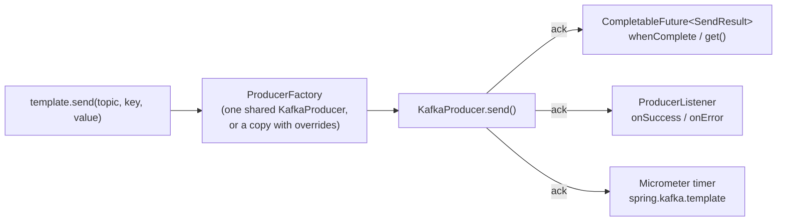

# 15 · KafkaTemplate

> **Level:** Essentials · **Read first:** [14](14-spring-boot-setup.md), [02](02-producer-batching-compression.md) · **Time:** ~10 min read, ~1 min run · [Glossary](glossary.md)
>
> **Demo:** `spring-template` (`./demo 15`) · [TemplateDemo.java](../spring-boot-kafka/src/main/java/io/kafkatweaks/spring/template/TemplateDemo.java) · [application-spring-template.yml](../spring-boot-kafka/src/main/resources/application-spring-template.yml) · **Recipes:** [TemplateRecipe.java](../spring-boot-kafka/src/main/java/io/kafkatweaks/spring/template/recipe/TemplateRecipe.java), [SendPatterns.java](../spring-boot-kafka/src/main/java/io/kafkatweaks/spring/template/recipe/SendPatterns.java) · **Plain-client version:** [01](01-producer-baseline.md), [02](02-producer-batching-compression.md), [05](05-producer-low-latency.md)
>
> **In one sentence:** `KafkaTemplate` is one shared producer with a future per send: waiting once instead of per record raised 114 to 15 520 records/s, and derived templates reran chapter 02's matrix without a second bean.

## The problem

`KafkaTemplate` is a thin, thread-safe wrapper around one `KafkaProducer` obtained from a `ProducerFactory`.
Everything chapters 01–05 said about batching, `linger.ms`, `acks` and compression still decides the numbers;
what the template adds is the Spring API around it: a `CompletableFuture<SendResult>` per send, a
`ProducerListener` for every acknowledgement, the `Message<?>` abstraction with headers, transactions
(chapter 19), Micrometer timers and observations, and the ability to derive templates with different producer
configs from a single factory without a second bean.



## The knobs

| Setting | Default | Meaning |
|---|---|---|
| `spring.kafka.producer.*` | client defaults | the producer configs of chapters 01–05 (`acks`, `batch-size`, `compression-type`, `properties[linger.ms]` …) for the auto-configured factory |
| `spring.kafka.template.default-topic` | none | topic used by `sendDefault(...)` |
| `spring.kafka.template.close-timeout` | 5 s | how long `close()` waits for in-flight records when the context shuts down |
| `spring.kafka.template.allow-non-transactional` | `false` | lets a transactional template send outside a transaction (chapter 19) |
| `spring.kafka.template.observation-enabled` | `false` | one Micrometer Observation (tracing span + metrics) per send instead of the plain timer |
| `KafkaTemplate(ProducerFactory, Map overrides)` | — | a template on a *copy* of the factory with different configs: separate producer, same bean-free lifecycle |
| `ProducerFactory.copyWithConfigurationOverride(Map)` | — | the same copy, when you want the factory itself |
| `ProducerListener` bean | `LoggingProducerListener` | called with every ack/error of the auto-configured template |
| `DefaultKafkaProducerFactory.setProducerPerThread(true)` | `false` | one producer per calling thread instead of one shared producer (isolates `flush()`; needs `closeThreadBoundProducer()`) |
| `setPhysicalCloseTimeout`, `setMaxAge` | 30 s / none | producer close budget; recreate a producer older than `maxAge` (matters for idle transactional producers) |
| `RoutingKafkaTemplate` | — | picks a `ProducerFactory` per topic pattern (different serializers per topic); no transactions/metrics |

## The code that matters

How to call the template, from [SendPatterns.java](../spring-boot-kafka/src/main/java/io/kafkatweaks/spring/template/recipe/SendPatterns.java):

<!-- recipe: spring-boot-kafka/src/main/java/io/kafkatweaks/spring/template/recipe/SendPatterns.java -->
```java
public static <K, V> List<SendResult<K, V>> sendAllAndWait(KafkaTemplate<K, V> template, List<ProducerRecord<K, V>> records) {
    List<CompletableFuture<SendResult<K, V>>> futures = records.stream().map(template::send).toList();
    CompletableFuture.allOf(futures.toArray(CompletableFuture[]::new)).join();
    return futures.stream().map(CompletableFuture::join).toList();
}
```

and a second producer configuration without a second bean, from
[TemplateRecipe.java](../spring-boot-kafka/src/main/java/io/kafkatweaks/spring/template/recipe/TemplateRecipe.java):

<!-- recipe: spring-boot-kafka/src/main/java/io/kafkatweaks/spring/template/recipe/TemplateRecipe.java -->
```java
public static final Map<String, Object> THROUGHPUT = Map.of(
        ProducerConfig.LINGER_MS_CONFIG, 50,
        ProducerConfig.BATCH_SIZE_CONFIG, 128 * 1024,
        ProducerConfig.COMPRESSION_TYPE_CONFIG, "zstd");
// ...
@Bean
CountingProducerListener producerListener() {
    return new CountingProducerListener();
}
// ...
public static <K, V> KafkaTemplate<K, V> derivedTemplate(ProducerFactory<K, V> factory, Map<String, Object> overrides) {
    return new KafkaTemplate<>(factory, overrides);
}
```

- **Send everything, wait once**: 15 520 records/s against 114 for `SendPatterns.sendAndWait` (`send().get()`) per
  record, through the same auto-configured template.
- **`derivedTemplate(factory, THROUGHPUT + a client.id)`** is its own producer from the one factory: 72.4K records/s
  against 19.8K for the defaults. Not a bean (a second `KafkaTemplate` bean switches Boot's off), so `destroy()` it
  when done; the `client.id` makes the copy happen and tags its metrics.
- **A `ProducerListener` bean** (`CountingProducerListener`) sees every acknowledgement of the auto-configured
  template: `onSuccess=2000` with no code at the call sites.
- `SendPatterns.sendWithHeaders(...)` is the `Message<?>` API: `KafkaHeaders.TOPIC`/`KEY` steer the send, other
  headers become record headers.

The demo calls these for parts 1, 3 and 4; everything else in
[TemplateDemo.java](../spring-boot-kafka/src/main/java/io/kafkatweaks/spring/template/TemplateDemo.java) is measurement.

## Run it

```bash
./mvnw -q -pl spring-boot-kafka -am compile spring-boot:run -Dspring-boot.run.arguments="spring-template"
```

Arguments: `records=20000` (per preset in the matrix), `sync=1000`, `size=512`.

## What you should see

**1. The future.** The same 1 000 records through the auto-configured template, waiting for each vs waiting once:

```
| mode                            | records | elapsed ms | records/s | how                                                      |
| send().get() per record         |    1000 |       8739 |       114 | one round trip per record; linger.ms never gets a chance |
| send() x N, then allOf().join() |    1000 |         64 |     15520 | batches form; whenComplete() for per-record results      |
```

**2. ProducerListener bean:** `onSuccess=2000 onError=0` for the two runs above, with no code at the call sites.

**3. The chapter-02 matrix through templates built from the one `ProducerFactory`** (20 000 records × 512 B, a
`KafkaTemplate(producerFactory, overrides)` per row, destroyed after use):

```
| run                                    | records/s | MB/s  | ack p50 ms | ack p99 ms | errors |
| defaults (linger 5, batch 16K, none)   |     19.8K | 10.81 |        502 |        746 |      0 |
| linger 50, batch 128K                  |     96.3K | 52.58 |      15.84 |      37.85 |      0 |
| linger 50, batch 128K, lz4             |     75.8K | 41.35 |       8.71 |      19.32 |      0 |
| linger 50, batch 128K, zstd            |     72.4K | 39.50 |       5.69 |      14.60 |      0 |
| linger 0, acks 1, none (latency first) |     32.0K | 17.46 |        195 |        359 |      0 |

| run                                    | record-send-rate | batch-size-avg | records-per-request-avg | compression-rate-avg | request-latency-avg | record-queue-time-avg | request-rate |
| defaults (linger 5, batch 16K, none)   |              645 |          16.0K |                   27.47 |                    1 |               19.55 |                   442 |        23.71 |
| linger 50, batch 128K                  |              662 |         129.4K |                     222 |                    1 |               14.72 |                  2.66 |         3.21 |
| linger 50, batch 128K, lz4             |              661 |          21.2K |                     263 |                 0.14 |                7.53 |                  3.61 |         2.74 |
| linger 50, batch 128K, zstd            |              661 |           9001 |                     263 |                 0.06 |                4.11 |                  3.82 |         2.74 |
| linger 0, acks 1, none (latency first) |              653 |          16.0K |                   27.47 |                    1 |               11.62 |                   185 |        23.97 |
```

**4. The messaging API.** A `Message<?>` whose `KafkaHeaders.TOPIC`/`KEY` headers steer the send and whose other
headers become record headers, and `sendDefault` to `spring.kafka.template.default-topic`:

```
| call                                                           | topic           | partition | offset | headers on the record            |
| send(Message<?>) with KafkaHeaders.TOPIC/KEY + tenant          | spring.template |         0 |  69.3K | tenant, spring_json_header_types |
| sendDefault(key, value)  [spring.kafka.template.default-topic] | spring.template |         2 |  75.1K |                                - |
```

**5. Micrometer**, read straight from the `MeterRegistry`:

```
| meter                               | tags                                                                                             | count   | mean ms |
| spring.kafka.template               | exception=none name=kafkaTemplate result=success                                                 |    2002 |  16.230 |
| kafka.producer.record.send.total    | client.id=spring-template-1 kafka.version=4.2.1 spring.id=kafkaProducerFactory.spring-template-1 | 2002.00 |         |
| kafka.producer.batch.size.avg       | client.id=spring-template-1 kafka.version=4.2.1 spring.id=kafkaProducerFactory.spring-template-1 | 1181.38 |         |
| kafka.producer.request.latency.avg  | client.id=spring-template-1 kafka.version=4.2.1 spring.id=kafkaProducerFactory.spring-template-1 |    3.60 |         |
```

## Reading the numbers

- **`send()` is asynchronous; `.get()` is a decision.** Waiting per record costs a full round trip each
  (114 records/s here) and defeats batching, exactly as in chapter 01. Fire the sends, keep the futures, and
  use `whenComplete` for per-record outcomes or `allOf(...).join()` for "all done". `template.flush()` forces
  the accumulator out when you need a batch to leave *now*.
- **The matrix is chapter 02 again, because it is the same producer.** A template adds nothing to the wire:
  `linger.ms` and `batch.size` multiply throughput by five, compression shrinks `batch-size-avg` (the metric
  counts bytes after compression) and keeps `records-per-request-avg` high, `acks=1` buys little without also
  fixing the batching. Tune `spring.kafka.producer.*` with the plain chapters open.
- **Several producer configs, one factory, zero extra beans.** `new KafkaTemplate<>(producerFactory, overrides)`
  copies the factory with the overrides (`copyWithConfigurationOverride`), so each template owns a producer with
  its own batching. It is not a bean on purpose: Boot's `kafkaTemplate` is `@ConditionalOnMissingBean(KafkaTemplate.class)`,
  and a second template bean removes the auto-configured one (and with it the `@RetryableTopic` default of
  chapter 18). An empty override map does *not* copy: give every variant at least a `client.id`, which also tags
  its metrics.
- **`ProducerListener` is the hook for cross-cutting send concerns** (metrics, audit, alerting on `onError`);
  it sees only the auto-configured template unless you call `setProducerListener` on the others.
- **Headers travel both ways.** Spring adds `spring_json_header_types` so the header values can be mapped back
  to their Java types on the consumer side (`@Header` parameters, chapter 16); it costs a few bytes per record and
  can be switched off with a custom `KafkaHeaderMapper`.

<details>
<summary>Deep dive: the two Micrometer metric families</summary>

- **Two metric families.** `spring.kafka.template` is spring-kafka's own timer per template *bean* (count, mean,
  result/exception tags). `kafka.producer.*` are the client's metrics of chapters 01–05, bound to Micrometer by
  Boot for every producer the factory creates and tagged `spring.id=<factory>.<client.id>`; they disappear when
  the producer is closed, which is why the tuned presets are gone from the table. `template.metrics()` gives the
  raw map when you want the plain chapters' `MetricsReport` view instead.

</details>

## Key takeaways

- **Send everything, wait once**: `send().get()` per record gave 114 records/s; firing all sends and joining once
  gave 15 520 through the same template.
- **The template adds nothing to the wire**: chapter 02's `linger.ms`, `batch.size` and compression still decide
  throughput, 19.8K → 96.3K records/s here.
- **Derive templates, do not declare them**: `new KafkaTemplate<>(factory, overrides)` with its own `client.id`; a
  second template bean switches Boot's off.

## When to use what

| Situation | Setting |
|---|---|
| high-volume producer | `spring.kafka.producer.batch-size`, `properties[linger.ms]`, `compression-type` from chapter 02; never `.get()` per record |
| must know a record was written before replying to a caller | `send(...).get(timeout)` or `.join()` on that one future; keep the rest asynchronous |
| one topic needs different batching / serializers | `new KafkaTemplate<>(producerFactory, overrides)` as a plain object (or a `RoutingKafkaTemplate`), not a second template bean |
| send metrics / failure alerting for the whole service | one `ProducerListener` bean |
| tracing across producer and consumer | `spring.kafka.template.observation-enabled=true` + `spring.kafka.listener.observation-enabled=true` and Micrometer Tracing on the classpath |
| a producer that idles for hours and is transactional | `DefaultKafkaProducerFactory.setMaxAge(...)` below the broker's `transactional.id.expiration.ms` (chapter 19) |
| graceful shutdown must not lose records | `spring.kafka.template.close-timeout` ≥ `delivery.timeout.ms` of in-flight batches, or `flush()` before returning |

---

← [14 · Spring Boot wiring and the `spring.kafka.*` mapping](14-spring-boot-setup.md) · [Index](README.md) · [16 · `@KafkaListener` and acknowledgment modes](16-spring-listeners-acks.md) →
