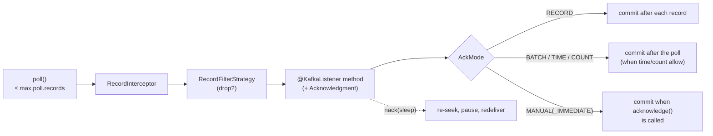

# 16 · `@KafkaListener` and acknowledgment modes

**Demo:** `spring-listener-acks` · [ListenerAcksDemo.java](../spring-boot-kafka/src/main/java/io/kafkatweaks/spring/listener/ListenerAcksDemo.java) · [application-spring-listener-acks.yml](../spring-boot-kafka/src/main/resources/application-spring-listener-acks.yml) · **Recipes:** [AckModeListeners.java](../spring-boot-kafka/src/main/java/io/kafkatweaks/spring/listener/recipe/AckModeListeners.java), [ReplayListener.java](../spring-boot-kafka/src/main/java/io/kafkatweaks/spring/listener/recipe/ReplayListener.java), [ListenerRecipe.java](../spring-boot-kafka/src/main/java/io/kafkatweaks/spring/listener/recipe/ListenerRecipe.java)

## The problem

Chapter 08 was about *when* a consumer commits: after the batch, before it, per record, by hand. In spring-kafka
the application never calls `commitSync`; the **listener container** owns the poll loop, sets
`enable.auto.commit=false` on the consumer it creates, and commits according to an `AckMode`. The container
also owns the poll loop's deadline problem of chapter 07 (`max.poll.interval.ms` is still yours to respect), the
seek API of chapter 08 (`ConsumerSeekAware`), and two extension points the plain client does not have: a
`RecordInterceptor` that runs before every listener call and a `RecordFilterStrategy` that drops records.



## The knobs

| Setting | Default | Meaning |
|---|---|---|
| `spring.kafka.listener.ack-mode` | `BATCH` | factory default; per listener: **`@KafkaListener(ackMode = "…")`** (spring-kafka 4.1, placeholders allowed) |
| `RECORD` | | commit after every record (synchronous: one round trip per record) |
| `BATCH` | | commit after the records of a `poll()` were processed |
| `TIME`, `COUNT`, `COUNT_TIME` | | like BATCH, but only if `ack-time` passed / `ack-count` records were processed / either |
| `MANUAL` | | the listener calls `Acknowledgment.acknowledge()`; the commit happens at the end of the poll |
| `MANUAL_IMMEDIATE` | | the commit happens right inside `acknowledge()` |
| `spring.kafka.listener.ack-count` / `ack-time` | 1 / 5 s | thresholds for the COUNT/TIME modes |
| `spring.kafka.listener.poll-timeout` | 5 s | the `Duration` handed to `poll()`; also the granularity of `nack(sleep)` and of `stop()` |
| `spring.kafka.listener.async-acks` | `false` | out-of-order `acknowledge()` (chapter 17) |
| `Acknowledgment.nack(Duration)` | | MANUAL modes only, listener thread only: commit what was acknowledged, discard the rest of the poll, seek back, pause for the duration, redeliver |
| `ConsumerSeekAware` | | `onPartitionsAssigned(assignments, callback)`: `seekToBeginning`, `seekToEnd`, `seek`, `seekRelative`, `seekToTimestamp`; also from `onIdleContainer` or any thread via the registered callback |
| `@TopicPartition` + `@PartitionOffset` | | manual assignment with an initial offset (`initialOffset`, `relativeToCurrent`), no rebalances |
| `@KafkaListener(filter = "bean")` / `RecordFilterStrategy` bean | | drop records before the listener; a bean typed `<Object,Object>` is wired into every container by Boot, a differently typed one only where named |
| `RecordInterceptor<Object,Object>` bean | | Boot wires it into the default factory: runs before every listener call (return `null` to skip the record) |
| `@KafkaListener(id, groupId, clientIdPrefix, topics, properties, concurrency, autoStartup)` | | `id` doubles as `groupId` unless `idIsGroup=false`; `properties = "max.poll.records:5"` overrides consumer configs for that listener |
| `spring.kafka.listener.auto-startup` | `true` | this repository sets `false` and starts listeners through `KafkaListenerEndpointRegistry` after seeding |
| `@Header(KafkaHeaders.RECEIVED_PARTITION)` etc. | | metadata as method parameters, when you do not want the whole `ConsumerRecord` |

## The code that matters

When a listener commits is one attribute, `ackMode`. From
[AckModeListeners.java](../spring-boot-kafka/src/main/java/io/kafkatweaks/spring/listener/recipe/AckModeListeners.java)
(`probe.*` calls are the demo's measurement; your processing goes there):

<!-- recipe: spring-boot-kafka/src/main/java/io/kafkatweaks/spring/listener/recipe/AckModeListeners.java -->
```java
@KafkaListener(id = "acks-batch", groupId = "spring-acks-batch", clientIdPrefix = "acks-batch", topics = TopicsConfig.LISTENER, ackMode = "BATCH")
public void batch(ConsumerRecord<String, String> record) {
    probe.hit("acks-batch");
}
// ...
@KafkaListener(id = "acks-nack", groupId = "spring-acks-nack", clientIdPrefix = "acks-nack", ackMode = "MANUAL",
        properties = "max.poll.records:5",
        topicPartitions = @TopicPartition(topic = TopicsConfig.LISTENER,
                partitionOffsets = @PartitionOffset(partition = "0", initialOffset = "0")))
public void nack(ConsumerRecord<String, String> record, Acknowledgment ack) {
    if (probe.nackOnce(record)) {   // the demo's script: offset 3, first delivery only
        ack.nack(Duration.ofSeconds(1));   // commit what was acked, drop the rest of this poll, seek back to this record, pause 1 s
    } else {
        ack.acknowledge();
    }
}
```

replay on assignment, from [ReplayListener.java](../spring-boot-kafka/src/main/java/io/kafkatweaks/spring/listener/recipe/ReplayListener.java):

<!-- recipe: spring-boot-kafka/src/main/java/io/kafkatweaks/spring/listener/recipe/ReplayListener.java -->
```java
public void onPartitionsAssigned(Map<TopicPartition, Long> assignments, ConsumerSeekCallback callback) {
    assignments.keySet().forEach(tp -> callback.seekRelative(tp.topic(), tp.partition(), -100, false));
}
```

and the two beans in front of the listener, from [ListenerRecipe.java](../spring-boot-kafka/src/main/java/io/kafkatweaks/spring/listener/recipe/ListenerRecipe.java):

<!-- recipe: spring-boot-kafka/src/main/java/io/kafkatweaks/spring/listener/recipe/ListenerRecipe.java -->
```java
@Bean
RecordFilterStrategy<String, String> oddOffsetFilter() {
    return record -> record.offset() % 2 == 1;   // true = discard
}

/** A {@code RecordInterceptor<Object, Object>}: Boot wires it into the default factory, so it runs before EVERY listener. */
@Bean
CountingRecordInterceptor countingInterceptor() {
    return new CountingRecordInterceptor();
}
```

- **`ackMode = "BATCH"`** (the default) committed 12 times for 6 000 records; `RECORD` committed 6 000 times and took
  15.8 s instead of ~110 ms.
- **`nack(Duration)`** is "retry this record after a pause" without seeking by hand: offset 3 came back after 1 015 ms,
  and offset 4 of the same poll was never delivered before it.
- **`seekRelative(-100)` on assignment** replayed exactly the last 100 records of each partition, whatever the group
  had committed; MANUAL without `acknowledge()` left the committed offsets alone.
- **The generic type is the switch**: the filter is typed `<String, String>` and only applies where named
  (`filter = "oddOffsetFilter"`), the `<Object, Object>` interceptor is global.

The demo starts each listener in turn; everything else in
[ListenerAcksDemo.java](../spring-boot-kafka/src/main/java/io/kafkatweaks/spring/listener/ListenerAcksDemo.java) and
[ListenerProbe.java](../spring-boot-kafka/src/main/java/io/kafkatweaks/spring/listener/ListenerProbe.java) is measurement.

## Run it

```bash
./mvnw -q -pl spring-boot-kafka -am compile spring-boot:run -Dspring-boot.run.arguments="spring-listener-acks"
```

Arguments: `records=6000` (RECORD mode commits once per record, so the topic is kept small).

## What you should see

**1. Five listeners, one topic, one difference: `ackMode`.** Records, commits (`commit-total` of the consumer's
coordinator metrics) and the time from `start()` to the last record:

```
| listener    | records | commits | commit-latency-avg ms | start -> drained ms | ackMode                                                                                   |
| acks-record |    6000 |    6000 |                  2.47 |               15815 | RECORD: commit after every record                                                         |
| acks-batch  |    6000 |      12 |                  3.17 |                 109 | BATCH: commit after the records of a poll were processed                                  |
| acks-time   |    6000 |       1 |                  3.00 |                 115 | TIME: like BATCH, but only if ack-time (1s) passed since the last commit                  |
| acks-count  |    6000 |       6 |                  3.17 |                 108 | COUNT: like BATCH, but only once ack-count (1000) records were processed                  |
| acks-manual |    6000 |      12 |                  4.75 |                 157 | MANUAL_IMMEDIATE: commit when the listener calls acknowledge() (here: every 500th record) |
```

**2. `nack`.** Partition 0 assigned by hand from offset 0, `max.poll.records=5`, the listener nacks offset 3 once:

```
| t ms | partition | offset | attempt | listener did  |
|    0 |         0 |      0 |       1 | acknowledge() |
|    0 |         0 |      1 |       1 | acknowledge() |
|    0 |         0 |      2 |       1 | acknowledge() |
|    0 |         0 |      3 |       1 | nack(1s)      |
| 1015 |         0 |      3 |       2 | acknowledge() |
| 1015 |         0 |      4 |       1 | acknowledge() |
| 1015 |         0 |      5 |       1 | acknowledge() |
```

Offset 4 was in the first poll but the listener never saw it then: the rest of the poll is discarded, the
consumer is paused for one second, and polling resumes *at* the nacked record.

**3. Replay with `ConsumerSeekAware`.** `seekRelative(-100)` on assignment, whatever the group had committed:

```
| partition | end offset | first offset the listener saw | records replayed |
|         0 |       1860 |                          1760 |              100 |
|         1 |       2520 |                          2420 |              100 |
|         2 |       1620 |                          1520 |              100 |
```

**4. Filter and interceptor** on one listener:

```
| where                                           | records | what                                                                          |
| RecordInterceptor (global, before the listener) |    6000 | saw every record of the poll                                                  |
| RecordFilterStrategy oddOffsetFilter            |    3000 | discarded (odd offsets)                                                       |
| listener method                                 |    3000 | got the rest; offsets of discarded records are still committed with the batch |
```

## Reading the numbers

- **RECORD costs a round trip per record.** 6 000 synchronous commits at ~2.5 ms each are the 15.8 s; every other
  mode drained the same records in about 100 ms and committed 1–12 times. RECORD is chapter 08's "commit after
  each record" strategy with the same price tag; use it only when one duplicate is expensive and throughput is
  irrelevant.
- **BATCH is the default because it is the sweet spot**: one commit per poll (12 polls of 500 records here), and
  the redelivery window after a crash is at most one poll. TIME and COUNT commit less often for the price of a
  larger window; MANUAL modes let the listener decide (`MANUAL_IMMEDIATE` commits inside `acknowledge()`,
  `MANUAL` only at the end of the poll).
- **`nack` is the "retry this record" primitive of chapter 08 without seeking by hand.** Acknowledged offsets are
  committed first, so nothing processed is redone; the pause keeps the consumer in the group (`poll()` continues,
  returning nothing); the resolution is `poll-timeout`, so a 5 s default makes every nack at least 5 s. It is only
  allowed in MANUAL modes and only from the listener thread; chapter 18's error handlers do the same seek-and-retry
  for exceptions, with back-off and a dead-letter destination.
- **Seeks on assignment beat `auto.offset.reset`.** `seekRelative(-100, false)` gave every partition exactly its
  last 100 records regardless of committed offsets; the listener ran in MANUAL mode without acknowledging, so the
  replay left the group's committed offsets untouched. `seekToTimestamp` is the "replay since 14:00" of chapter 08.
- **Filter and interceptor sit before the listener, not before the commit.** Discarded records are still part of
  the poll and their offsets are committed with it (`ackDiscarded=false` only matters in MANUAL modes). The
  interceptor is global for the factory; the filter applies where it is named (or globally, if its bean is typed
  `RecordFilterStrategy<Object,Object>`, which is what Boot's auto-configuration looks for).
- **`start()`/`stop()` are cheap; joining is not free.** The ~100 ms rows include the group join; with
  `spring.kafka.listener.auto-startup=false` and the registry a service can start listeners after a warm-up or a
  migration, and stop them for maintenance, without a restart.

## When to use what

| Situation | Setting |
|---|---|
| default | `BATCH`; size the redelivery window with `max-poll-records` |
| handler is idempotent, throughput matters | `BATCH` or `COUNT`/`TIME` with larger thresholds |
| one duplicate is very expensive | `RECORD` (and accept the commit rate) or `MANUAL_IMMEDIATE` right after the side effect |
| the listener hands work to other threads | `MANUAL` + `asyncAcks` (chapter 17), acknowledge when the work is done |
| a record must be retried after a pause, no error handler involved | `MANUAL` + `nack(Duration)`; lower `poll-timeout` for finer pauses |
| replay from a point in time or the last N records | `ConsumerSeekAware.onPartitionsAssigned` with `seekToTimestamp` / `seekRelative` |
| a listener must read a fixed partition from a fixed offset | `@TopicPartition` + `@PartitionOffset` (no group management) |
| skip records cheaply | `RecordFilterStrategy` named in `filter`; global when typed `<Object,Object>` |
| tracing, MDC, audit for every record | one `RecordInterceptor<Object,Object>` bean |
| a listener needs its own consumer settings | `@KafkaListener(properties = {"max.poll.records:50"})` |
