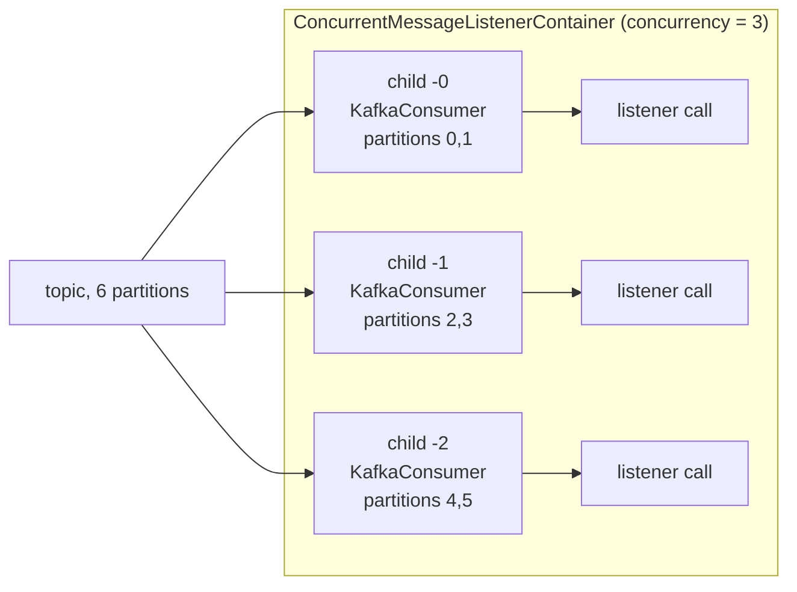

# 17 · Concurrency, batch listeners and back-pressure

**Demo:** `spring-concurrency` · [ConcurrencyDemo.java](../spring-boot-kafka/src/main/java/io/kafkatweaks/spring/parallel/ConcurrencyDemo.java) · [application-spring-concurrency.yml](../spring-boot-kafka/src/main/resources/application-spring-concurrency.yml) · **Recipes:** [ParallelListeners.java](../spring-boot-kafka/src/main/java/io/kafkatweaks/spring/parallel/recipe/ParallelListeners.java), [ConcurrencyRecipe.java](../spring-boot-kafka/src/main/java/io/kafkatweaks/spring/parallel/recipe/ConcurrencyRecipe.java), [BackPressure.java](../spring-boot-kafka/src/main/java/io/kafkatweaks/spring/parallel/recipe/BackPressure.java)

## The problem

Chapter 10 scaled a consumer three ways: more consumers in the group, a worker pool behind one consumer, and
pause/resume as the brake. spring-kafka has a word for each. `concurrency` is "more consumers": the
`ConcurrentMessageListenerContainer` runs that many child containers, each with its own `KafkaConsumer` on
its own thread, all in the same group. A **batch listener** receives the whole poll in one call. `asyncAcks`
lets a listener hand records to other threads and acknowledge them in any order while the container keeps
the commits in order. And `pause()`/`resume()` on the container is the back-pressure switch, wired to
Spring application events. With Boot's `spring.threads.virtual.enabled=true` the consumer threads themselves
are virtual.



## The knobs

| Setting | Default | Meaning |
|---|---|---|
| `spring.kafka.listener.concurrency` / `@KafkaListener(concurrency = "n")` | 1 | child containers = consumers in the group; more than partitions means idle consumers |
| `spring.kafka.listener.type` = `single` / `batch`, `@KafkaListener(batch = "true")` | `single` | one record per call, or the poll as `List<ConsumerRecord>` / `ConsumerRecords` / `List<Foo>` |
| `spring.kafka.consumer.max-poll-records` | 500 | the upper bound of a batch call; with `BATCH` ack mode also the redelivery window |
| `spring.kafka.listener.async-acks` / `ContainerProperties.setAsyncAcks(true)` | `false` | out-of-order `acknowledge()`; the container commits contiguous prefixes and pauses until the poll is fully acknowledged; MANUAL modes only, no `nack` |
| `spring.threads.virtual.enabled` | `false` | Boot gives the container factory a virtual-thread `SimpleAsyncTaskExecutor`: consumer threads are virtual |
| `MessageListenerContainer.pause()` / `resume()` | | takes effect around the next `poll()`; `isContainerPaused()`; `pausePartition(tp)` for one partition |
| `ContainerProperties.setPauseImmediate(true)` | `false` | stop after the current record instead of after the current poll |
| `spring.kafka.listener.idle-between-polls` | 0 | sleep between polls: the crude throttle |
| `spring.kafka.listener.idle-event-interval` | none | publish `ListenerContainerIdleEvent` when nothing arrives for this long (a "caught up" signal) |
| `ConsumerPausedEvent`, `ConsumerResumedEvent`, `ListenerContainerIdleEvent`, `NonResponsiveConsumerEvent` | | container events for any `@EventListener` |
| a second `ConcurrentKafkaListenerContainerFactory` bean + `ConcurrentKafkaListenerContainerFactoryConfigurer` | | Boot's `spring.kafka.listener.*` applied, then your `ContainerProperties` on top (`asyncAcks`, `deliveryAttemptHeader`, `pauseImmediate`, `micrometerTags`); listeners choose it with `containerFactory` |
| `@KafkaListener(properties = "max.partition.fetch.bytes:16384")` | | per-listener consumer configs, here chapter 10's trick to make one poll span all partitions |
| `spring.kafka.consumer.properties[group.instance.id]` | | static membership; concurrent containers suffix `-n` automatically |

## The code that matters

Most of it is attributes, from [ParallelListeners.java](../spring-boot-kafka/src/main/java/io/kafkatweaks/spring/parallel/recipe/ParallelListeners.java)
(`probe.*` calls are the demo's simulated work and measurement):

<!-- recipe: spring-boot-kafka/src/main/java/io/kafkatweaks/spring/parallel/recipe/ParallelListeners.java -->
```java
@KafkaListener(id = "par-6", groupId = "spring-par-6", clientIdPrefix = "par-6", topics = TopicsConfig.PARALLEL, concurrency = "6")
public void six(ConsumerRecord<String, String> record) {
    probe.work();
    probe.done("par-6", 1);
}
// ...
@KafkaListener(id = "par-batch", groupId = "spring-par-batch", clientIdPrefix = "par-batch", topics = TopicsConfig.PARALLEL, batch = "true")
public void batch(List<ConsumerRecord<String, String>> records) {
    probe.bulkWrite(records.size());   // the cost model of a bulk write: one round trip per CALL, not one per record
    probe.done("par-batch", records.size());
}
// ...
@KafkaListener(id = "par-async", groupId = "spring-par-async", clientIdPrefix = "par-async", topics = TopicsConfig.PARALLEL,
        concurrency = "1", ackMode = "MANUAL", containerFactory = "asyncAckContainerFactory",
        properties = "max.partition.fetch.bytes:16384")   // small per-partition fetches => a poll mixes all partitions (chapter 10)
public void async(ConsumerRecord<String, String> record, Acknowledgment ack) {
    // ...
    partitionWorkers.computeIfAbsent(record.partition(),
                    p -> Executors.newSingleThreadExecutor(Thread.ofVirtual().name("worker-p" + p).factory()))
            .execute(() -> {
                probe.work();
                // ...
                ack.acknowledge();
                probe.done("par-async", 1);
            });
}
```

plus one container factory, from [ConcurrencyRecipe.java](../spring-boot-kafka/src/main/java/io/kafkatweaks/spring/parallel/recipe/ConcurrencyRecipe.java):

<!-- recipe: spring-boot-kafka/src/main/java/io/kafkatweaks/spring/parallel/recipe/ConcurrencyRecipe.java -->
```java
var factory = new ConcurrentKafkaListenerContainerFactory<Object, Object>();
configurer.configure(factory, consumerFactory);
// Acknowledgements may arrive in any order; the container commits contiguous prefixes and pauses the
// consumer until every record of the poll is acknowledged. Requires ackMode MANUAL or MANUAL_IMMEDIATE.
factory.getContainerProperties().setAsyncAcks(true);
return factory;
```

- **`concurrency = "6"`** on 6 partitions drained the topic 4× faster than one consumer (2 098 vs 501 records/s);
  `concurrency = "8"` added nothing, two of its consumers got no partition.
- **`batch = "true"`** with a bulk-write cost of 2 ms per call: 83 105 records/s, because the cost is paid per poll.
- **`asyncAcks` + per-partition workers**: one consumer thread reached 1 608 records/s, ordering per partition kept.
  The container pauses the consumer until every record of a poll is acknowledged (187 pause/resume pairs).
- **`BackPressure.pause(id)` / `resume(id)`**
  ([BackPressure.java](../spring-boot-kafka/src/main/java/io/kafkatweaks/spring/parallel/recipe/BackPressure.java)):
  0 records in 2 s of pause, the consumer stayed in the group, delivery continued after resume.
- Virtual threads for every container are one line of yml: `spring.threads.virtual.enabled: true`.

The demo starts each listener in turn; everything else in
[ConcurrencyDemo.java](../spring-boot-kafka/src/main/java/io/kafkatweaks/spring/parallel/ConcurrencyDemo.java) and
[ParallelProbe.java](../spring-boot-kafka/src/main/java/io/kafkatweaks/spring/parallel/ParallelProbe.java) is measurement.

## Run it

```bash
./mvnw -q -pl spring-boot-kafka -am compile spring-boot:run -Dspring-boot.run.arguments="spring-concurrency"
```

Arguments: `records=18000`, `work=1` (ms of simulated work per record). The topic is recreated and seeded with
producer-default batches every run (part 3 needs small batches, see chapter 07's "the broker never re-batches").

## What you should see

**1. The same handler with 1, 3, 6 and 8 consumers** on a 6-partition topic. `parkNanos(1 ms)` costs about 2 ms
on this machine, which is what the `spring.kafka.listener` timer measures per call:

```
| listener | concurrency | consumers that got partitions | records | start -> drained ms | records/s | ms per record | timer mean ms | threads   |
| par-1    |           1 |                        1 of 1 |   18.0K |               35902 |       501 |          1.99 |         1.954 | 1 virtual |
| par-3    |           3 |                        3 of 3 |   18.0K |               13623 |      1321 |          0.76 |         1.955 | 3 virtual |
| par-6    |           6 |                        6 of 6 |   18.0K |                8578 |      2098 |          0.48 |         1.951 | 6 virtual |
| par-8    |           8 |                        6 of 8 |   18.0K |                8461 |      2127 |          0.47 |         1.927 | 6 virtual |
```

**2. A batch listener** (`batch="true"`, concurrency from `spring.kafka.listener.concurrency=3`), with a bulk-write
cost model of 2 ms per *call*:

```
| listener  | concurrency (from yml) | calls | records/call avg | largest call | start -> drained ms | records/s | timer mean ms per call |
| par-batch |                      3 |    38 |            473.7 |          500 |                 217 |     83105 |                  2.688 |
```

**3. One consumer thread, six virtual workers, `asyncAcks`:**

```
| listener  | consumer threads | workers                      | records | start -> drained ms | records/s | compare with                                           |
| par-async |                1 | 6 virtual, one per partition |   18.0K |               11195 |      1608 | par-1 (same single consumer) and par-6 (six consumers) |
```

187 `ConsumerPausedEvent`/`ConsumerResumedEvent` pairs came from this listener alone: the container pauses the
consumer after every poll until all of its records are acknowledged.

**4. `pause()` / `resume()`** on a running container:

```
| moment                      | records processed | what happened                                                                    |
| pause() called after 400 ms |               500 | takes effect before the next poll(); records already fetched are still delivered |
|                   2 s later |               500 | paused: poll() keeps the membership alive and returns nothing (0 more records)   |
|        1.5 s after resume() |              1308 | delivery continues from the committed position                                   |
```

followed by the two events the container published (`ConsumerPausedEvent [spring.parallel-0 … -5]`,
`ConsumerResumedEvent [...]`) and 13 `ListenerContainerIdleEvent`s from the containers that had drained.

## Reading the numbers

- **Concurrency scales until partitions run out.** 1 → 3 → 6 consumers is 36 s → 13.6 s → 8.6 s; 8 consumers is
  no faster than 6 because two of them own nothing (`6 of 8`). The scaling is not perfectly linear even below
  the partition count: 6 partitions over 3 consumers is 2 each, and the per-record cost includes a poll loop
  that only one thread per child runs. Rule of chapter 10, Spring spelling: `concurrency ≤ partitions`, and
  raise partitions first if you need more.
- **A batch listener changes the cost model, not the records.** Each call got up to `max.poll.records` (500)
  records; at 2 ms per call instead of 2 ms per record it drained in 0.2 s. That is the honest pitch for batch
  listeners: bulk writes, bulk HTTP, one transaction per batch. If the work is per record anyway, the batch
  brings nothing but a bigger redelivery unit (chapter 18: `BatchListenerFailedException` to point at the
  failing record).
- **`asyncAcks` is chapter 10's worker pool with the container doing the offset bookkeeping.** One consumer
  thread, six per-partition virtual workers, `acknowledge()` from the workers, and the container commits only
  contiguous prefixes: 3.2× faster than the single consumer while keeping order per partition. It is not 6×
  because the container pauses until *every* record of a poll is acknowledged, so each poll waits for its
  slowest partition; smaller polls (`max-poll-records`) or a partition-balanced fetch trade throughput for
  smoother flow. And chapter 10's lesson applied verbatim: without `max.partition.fetch.bytes=16K` a 500-record
  poll comes from one partition and only one worker is busy (25 s instead of 11 s in an earlier run).
- **Virtual threads cost nothing here and save carrier threads elsewhere.** Every listener ran on virtual
  threads (`spring.threads.virtual.enabled=true`); blocking in a handler (JDBC, HTTP) parks the virtual thread
  instead of a platform one. The poll loop itself is still one thread per consumer, so this does not replace
  concurrency; it makes high concurrency cheap.
- **`pause()` is polite.** It takes effect before the next poll, so a poll's worth of records (500) still
  arrives; `pauseImmediate=true` shortens that to one record. While paused the container keeps polling and
  stays in the group (no rebalance), which is the point over simply stopping. `resume()` picks up at the
  committed position. Use it for downstream outages, rate limits, or the "in-flight too high" gate of chapter 10.
- **Events are the observability of containers.** Idle events tell you a listener has caught up (or a topic
  went quiet), pause/resume events show back-pressure at work, `NonResponsiveConsumerEvent` catches a stuck
  poll loop before `max.poll.interval.ms` does.

## When to use what

| Situation | Setting |
|---|---|
| more throughput, per-record handler | `concurrency` up to the partition count; then more partitions |
| per-record handler that blocks on I/O | `spring.threads.virtual.enabled=true` and higher concurrency, or the asyncAcks hand-off |
| handler can process in bulk (DB batch, bulk HTTP) | `batch = "true"`, size with `max-poll-records`, `BatchListenerFailedException` for partial failures |
| ordering per key with parallel work | `MANUAL` + `asyncAcks`, one worker per partition, small `max.partition.fetch.bytes` |
| downstream is slow or rate-limited | `pause()`/`resume()` from a health check or an in-flight counter; `pauseImmediate` if 500 records are too many |
| "we are caught up" signal | `idle-event-interval` + `@EventListener(ListenerContainerIdleEvent)` |
| a container setting Boot has no key for | a second factory built with `ConcurrentKafkaListenerContainerFactoryConfigurer`, chosen by `containerFactory` |
| rolling restarts without rebalances | `group.instance.id` (static membership); concurrent children get `-n` suffixes for free |
