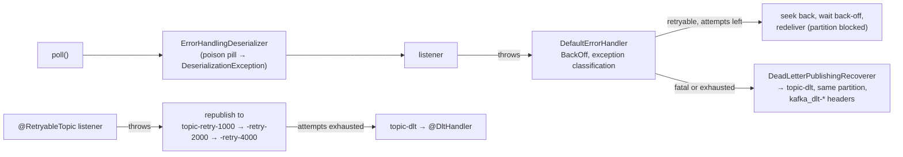

# 18 · Error handling, retries, dead letters and `@RetryableTopic`

**Demo:** `spring-error-handling` · [ErrorHandlingDemo.java](../spring-boot-kafka/src/main/java/io/kafkatweaks/spring/errors/ErrorHandlingDemo.java) · [ErrorListeners.java](../spring-boot-kafka/src/main/java/io/kafkatweaks/spring/errors/ErrorListeners.java) · [application-spring-error-handling.yml](../spring-boot-kafka/src/main/resources/application-spring-error-handling.yml)

## The problem

A plain consumer that throws in its loop has three options, all hand-written: skip, retry in place, or park
the record somewhere. Chapter 08 ended with "at-least-once plus an idempotent handler"; this chapter is what
happens *before* that handler gives up. spring-kafka's container catches the exception and hands it to a
`CommonErrorHandler`. The default one retries in place with a back-off and then calls a recoverer, typically the
`DeadLetterPublishingRecoverer`. That is **blocking**: the partition waits. `@RetryableTopic` is the
**non-blocking** alternative: the failed record is re-published to a retry topic with a delay, the partition
moves on, and after the last attempt the record lands in a dead-letter topic with a `@DltHandler`. A record that
cannot even be deserialized never reaches a listener; `ErrorHandlingDeserializer` turns that into an exception
the same machinery understands.



## The knobs

| Setting | Default | Meaning |
|---|---|---|
| `DefaultErrorHandler` (per container factory) | `FixedBackOff(0, 9)`: 10 attempts, no wait | the container's error handler; Boot wires a `CommonErrorHandler` **bean** into the default factory |
| `FixedBackOff(interval, maxAttempts)`, `ExponentialBackOffWithMaxRetries(n)` (+ `setInitialInterval`, `setMultiplier`, `setMaxInterval`) | | how long the partition waits between attempts |
| `addNotRetryableExceptions(...)` / `addRetryableExceptions(...)` | fatal: `DeserializationException`, `MessageConversionException`, `ConversionException`, `MethodArgumentResolutionException`, `NoSuchMethodException`, `ClassCastException` | classification; the handler looks through `ListenerExecutionFailedException` at the cause |
| `setResetStateOnExceptionChange` | `true` | a different exception restarts the back-off sequence |
| `setSeekAfterError` | `true` | re-seek to redeliver (false keeps the records in memory) |
| `DeadLetterPublishingRecoverer(template)` | destination `<topic>-dlt`, same partition | publishes the failed record with headers `kafka_dlt-original-topic/partition/offset/timestamp`, `kafka_dlt-exception-fqcn`, `kafka_dlt-exception-cause-fqcn`, `kafka_dlt-exception-message`, `kafka_dlt-exception-stacktrace`; a `BiFunction` resolver changes the destination |
| the recoverer's template | | must serialize what it gets: the original `byte[]` after a deserialization failure, the deserialized object otherwise → `DelegatingByTypeSerializer` |
| `ContainerProperties.setDeliveryAttemptHeader(true)` | `false` | adds `kafka_deliveryAttempt` (int) to every delivery |
| `spring.kafka.consumer.value-deserializer: ErrorHandlingDeserializer` + `properties["[spring.deserializer.value.delegate.class]"]` | | a deserializer that never throws: the record arrives with a `null` value and an exception header; the handler treats it as fatal |
| `BatchListenerFailedException(msg, record)` | | batch listeners: tells the handler which record failed, so only it and the rest of the batch are redelivered |
| `CommonContainerStoppingErrorHandler`, `CommonLoggingErrorHandler`, `CommonDelegatingErrorHandler` | | stop the container / log and skip / pick a handler per exception type |
| `@RetryableTopic(attempts, backOff = @BackOff(delay, multiplier, maxDelay), include/exclude, numPartitions, replicationFactor, autoCreateTopics, topicSuffixingStrategy, sameIntervalTopicReuseStrategy, dltStrategy, kafkaTemplate)` | 3 attempts, 1 s, 1 partition, broker default RF | non-blocking retries; topics `<topic>-retry-<delay>` and `<topic>-dlt`; needs a `KafkaTemplate` bean (the single one, or named) |
| `@DltHandler` | log only | the method that receives what exhausted its attempts; the exception travels in `kafka_exception-*` headers |
| `spring.kafka.retry.topic.enabled` + `attempts`, `backoff.*` | off | Boot's global alternative: the same for *every* listener, no annotation |
| limits | | `@RetryableTopic` does not combine with batch listeners or with container transactions (chapter 19) |

## Run it

```bash
./mvnw -q -pl spring-boot-kafka -am compile spring-boot:run -Dspring-boot.run.arguments="spring-error-handling"
```

The record keys script the failures (`FailureScript`): `ok-n` succeeds, `flaky<k>-n` throws a retryable
`TransientFailure` on the first k attempts, `fatal-n` throws `IllegalArgumentException` (registered as not
retryable), `poison-n` has a value that is not JSON.

## What you should see

**1. Blocking retries.** Eight records, `ExponentialBackOffWithMaxRetries(3)` at 200/400/800 ms, JSON values,
`ErrorHandlingDeserializer` in front of `JacksonJsonDeserializer`:

```
| t ms | partition | key                                 | attempt | kafka_deliveryAttempt header | ms since send | listener                        |
|  474 |         2 | ok-1  (succeeds)                    |       1 |                            1 |           379 | processed                       |
| 1016 |         1 | ok-5  (succeeds)                    |       1 |                            1 |           794 | processed                       |
| 1016 |         1 | flaky9-6  (fails 9x, then succeeds) |       1 |                            1 |           775 | throws TransientFailure         |
| 1225 |         0 | ok-2  (succeeds)                    |       1 |                            1 |          1036 | processed                       |
| 1225 |         0 | flaky2-3  (fails 2x, then succeeds) |       1 |                            1 |          1021 | throws TransientFailure         |
| 1520 |         1 | flaky9-6  (fails 9x, then succeeds) |       2 |                            2 |          1279 | throws TransientFailure         |
| 1930 |         0 | flaky2-3  (fails 2x, then succeeds) |       2 |                            2 |          1726 | throws TransientFailure         |
| 2344 |         1 | flaky9-6  (fails 9x, then succeeds) |       3 |                            3 |          2103 | throws TransientFailure         |
| 3155 |         1 | flaky9-6  (fails 9x, then succeeds) |       4 |                            4 |          2914 | throws TransientFailure         |
| 3183 |         0 | flaky2-3  (fails 2x, then succeeds) |       3 |                            3 |          2979 | processed                       |
| 3183 |         0 | fatal-4  (not retryable)            |       1 |                            1 |          2970 | throws IllegalArgumentException |
| 3687 |         0 | ok-7  (succeeds)                    |       1 |                            1 |          3437 | processed                       |
```

and the dead-letter topic afterwards:

```
| DLT key  | value                                 | kafka_dlt-exception-fqcn         | kafka_dlt-exception-cause-fqcn | original topic-partition@offset |
| fatal-4  | {"orderId":"ORD-2475","customerId"... | ListenerExecutionFailedException | IllegalArgumentException       | spring.errors-0@2               |
| flaky9-6 | {"orderId":"ORD-41977","customerId... | ListenerExecutionFailedException | TransientFailure               | spring.errors-1@1               |
| poison-8 | {not json                             | DeserializationException         | DeserializationException       | spring.errors-2@1               |
```

**2. Non-blocking retries** with `@RetryableTopic(attempts = "4", backOff = @BackOff(delay = 1000, multiplier = 2.0))`:

```
| t ms  | topic       | partition | key                                 | attempt | retry_topic-attempts header | ms since original send | listener                                      |
|  4877 | main        |         2 | ok-1  (succeeds)                    |       1 |                           - |                     11 | processed                                     |
|  4887 | main        |         0 | flaky2-2  (fails 2x, then succeeds) |       1 |                           - |                     10 | throws TransientFailure                       |
|  4917 | main        |         2 | flaky9-3  (fails 9x, then succeeds) |       1 |                           - |                     31 | throws TransientFailure                       |
|  5422 | main        |         0 | ok-4  (succeeds)                    |       1 |                           - |                    527 | processed                                     |
|  5896 | -retry-1000 |         0 | flaky2-2  (fails 2x, then succeeds) |       2 |                           2 |                   1019 | throws TransientFailure                       |
|  5921 | -retry-1000 |         2 | flaky9-3  (fails 9x, then succeeds) |       2 |                           2 |                   1035 | throws TransientFailure                       |
|  7902 | -retry-2000 |         0 | flaky2-2  (fails 2x, then succeeds) |       3 |                           3 |                   3025 | processed                                     |
|  7925 | -retry-2000 |         2 | flaky9-3  (fails 9x, then succeeds) |       3 |                           3 |                   3039 | throws TransientFailure                       |
| 11.9K | -retry-4000 |         2 | flaky9-3  (fails 9x, then succeeds) |       4 |                           4 |                   7045 | throws TransientFailure                       |
| 12.4K |        -dlt |         2 | flaky9-3  (fails 9x, then succeeds) |       4 |                           5 |                   7561 | @DltHandler: ListenerExecutionFailedException |
```

**3. What the innocent records paid:**

```
| strategy              | slowest 'ok' record (ms from send to processing) | why                                                                      |
| blocking (part 1)     |                                             3437 | the partition waits while flaky9-6 is retried 3 times with back-off      |
| non-blocking (part 2) |                                              527 | the failed record leaves the partition; ok records are processed at once |
```

## Reading the numbers

- **Blocking retry is a partition-wide pause.** `flaky9-6` was tried at 1016, 1520, 2344 and 3155 ms: the 200,
  400 and 800 ms back-offs, each one blocking partition 1. `ok-7` sat behind `flaky2-3` and `fatal-4` in partition 0
  for 3.4 s. Back-off is cheap for the failing record and expensive for its neighbours, which is why the default
  handler retries **ten times with no wait**: fast failures for transient blips, nothing else.
- **Classification decides between retry and dead letter.** `IllegalArgumentException` was registered as not
  retryable and went to the DLT after one attempt. The handler classifies by the *cause* inside
  `ListenerExecutionFailedException`, so throw meaningful exceptions from listeners. The
  `kafka_dlt-exception-cause-fqcn` header shows the real reason; `-fqcn` shows Spring's wrapper.
- **A poison pill never reaches the listener.** `ErrorHandlingDeserializer` returned a `null` value with a
  `DeserializationException` in a header; the container turned that into a fatal error, and the recoverer
  published the **original bytes** to the DLT. Without it the consumer would throw on every poll and the
  partition would be stuck forever. The recoverer's template needs a serializer that accepts `byte[]` as well as
  the normal value type (`DelegatingByTypeSerializer`).
- **Same partition, same key, a lot of context.** The DLT record keeps the key, so a DLT consumer can still
  group by entity, and the headers say where it came from (`spring.errors-0@2`) and why. A DLT is an
  operational queue, not a bit bucket: something has to read it (chapter 20's share consumers are a good fit).
- **Non-blocking retry moves the wait off the partition.** `flaky2-2` failed at 4887 ms, was re-published to
  `-retry-1000` and processed there at 5896 ms; `ok-4` behind it was processed after 527 ms instead of seconds.
  Each retry topic has its own container (five listener ids in the output), the attempt count travels in
  `retry_topic-attempts`, and the final record reaches `@DltHandler` with `kafka_exception-*` headers. The price:
  ordering per key is gone (a retried record is processed after its successors), the record is copied once per
  attempt, and topics multiply (`numPartitions` defaults to 1: set it).
- **Both are at-least-once.** A retried record was seen by the listener before; the DLT record may be a
  duplicate of a side effect that half happened. Chapter 08's idempotent handler still applies.

## When to use what

| Situation | Setting |
|---|---|
| transient failures (timeouts, 5xx) that clear in milliseconds | default `DefaultErrorHandler` or `FixedBackOff(100, 3)`; keep the partition pause short |
| transient failures that need seconds to minutes | `@RetryableTopic` with exponential back-off; accept the loss of ordering |
| bugs and bad data | `addNotRetryableExceptions(...)` so they go straight to the DLT; alert on the DLT |
| records that cannot be deserialized | `ErrorHandlingDeserializer` + a DLT recoverer with `DelegatingByTypeSerializer` |
| order per key must survive failures | blocking retries only; no `@RetryableTopic` |
| a downstream outage: stop instead of burning through records | `CommonContainerStoppingErrorHandler` (and chapter 17's pause) |
| batch listeners | throw `BatchListenerFailedException(msg, record)` from the loop, so the handler knows the index |
| the same policy for every listener, no annotations | `spring.kafka.retry.topic.enabled=true` + `spring.kafka.retry.topic.*` |
| exactly-once processor (chapter 19) | blocking retries via `DefaultAfterRollbackProcessor`; `@RetryableTopic` is not compatible with container transactions |
