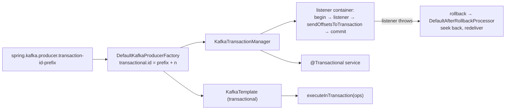

# 19 · Transactions in Spring

**Demo:** `spring-transactions` · [TransactionsDemo.java](../spring-boot-kafka/src/main/java/io/kafkatweaks/spring/txn/TransactionsDemo.java) · [TxnProcessorListener.java](../spring-boot-kafka/src/main/java/io/kafkatweaks/spring/txn/TxnProcessorListener.java) · [application-spring-transactions.yml](../spring-boot-kafka/src/main/resources/application-spring-transactions.yml)

## The problem

Chapter 06 wrote the transaction protocol by hand: `initTransactions`, `beginTransaction`, `send`,
`sendOffsetsToTransaction`, `commitTransaction`, and the fencing that makes a restarted instance safe. In
Spring one property does the wiring: `spring.kafka.producer.transaction-id-prefix` turns the producer factory
into a pool of transactional producers, auto-configures a `KafkaTransactionManager`, and hands it to the
listener container factory. From then on `KafkaTemplate.executeInTransaction`, `@Transactional`, and the
container itself (a transaction around the listener call, offsets sent inside it) do what chapter 06 did.
What stays yours: choosing `read_committed` on the consumers, keeping transactions short, and knowing that a
record listener means **one transaction per record**.



## The knobs

| Setting | Default | Meaning |
|---|---|---|
| `spring.kafka.producer.transaction-id-prefix` | none | enables everything: `transactional.id = prefix + n` per producer of the pool; **unique prefix per application instance** |
| `KafkaTransactionManager` | auto-configured with the prefix | a `PlatformTransactionManager`; wired into the default container factory and usable by `@Transactional` |
| `KafkaTemplate.executeInTransaction(ops -> …)` | | a local transaction: committed when the callback returns, rolled back when it throws; independent of any surrounding transaction |
| `@Transactional` on a service method | | the same, declaratively; every template operation inside joins; also chains with a JDBC transaction manager (Kafka commits after the database) |
| `spring.kafka.template.allow-non-transactional` | `false` | a transactional template throws `IllegalStateException` on a `send()` outside a transaction; `true` lets it use a non-transactional producer for that call |
| `spring.kafka.consumer.isolation-level` | `read_uncommitted` | `read_committed` for every consumer of transactional output, listeners included |
| container transactions | on, when the factory has a `KafkaAwareTransactionManager` | record listener: a transaction **per record**; batch listener: a transaction **per poll**; offsets go in via `sendOffsetsToTransaction(offsets, groupMetadata)` (`EOSMode.V2`, the only mode) |
| `AfterRollbackProcessor` (`DefaultAfterRollbackProcessor`) | `FixedBackOff(0, 9)` | after a rollback: seek back to the failed records so the next poll redelivers them; optional recoverer after the back-off is exhausted |
| `spring.kafka.listener.immediate-stop` | `false` | `stop()` normally finishes the current poll's records first (500 × handler time); `true` stops after the current record |
| `DefaultKafkaProducerFactory.setMaxAge(...)` | none | recreate idle transactional producers before the broker's `transactional.id.expiration.ms` fences them |
| `TransactionIdSuffixStrategy` / `maxCache` | unbounded | bound the suffix pool; `maxCache ≥ concurrency` for containers |
| not compatible | | `@RetryableTopic` (chapter 18) with container transactions; recreating a topic under a live transactional producer (see below) |

## Run it

```bash
./mvnw -q -pl spring-boot-kafka -am compile spring-boot:run -Dspring-boot.run.arguments="spring-transactions"
```

Arguments: `records=1200` (input records for part 4), `sample=200` (records the per-record listener is stopped
after), `crash=800` (the record at which the batch listener throws once).

## What you should see

**1. `executeInTransaction`:** ten records sent then a `throw`, ten records sent and a normal return, the same
topic read with both isolation levels:

```
| isolation.level  | records seen | keys              |
| read_uncommitted |           20 | aborted,committed |
| read_committed   |           10 | committed         |
```

**2. A plain `send()` on the transactional template:**

```
| template                                                        | allowNonTransactional | send() outside a transaction                                                   |
| kafkaTemplate (Boot)                                            | false                 | IllegalStateException: No transaction is in process; possible solutions: ...    |
| new KafkaTemplate(sameFactory) + setAllowNonTransactional(true) | true                  | succeeded: the factory hands out a non-transactional producer for this call    |
```

**3. `@Transactional`:** `transfer t1 committed 3 records, transfer t2 (threw) committed 0`.

**4. The consume-transform-produce processor** (1 200 input records, `max.poll.records=500`), once as a record
listener stopped after 200 records, once as a batch listener that throws in the middle of its second poll:

```
| listener                               | records processed | transactions                                | ms    | ms per transaction | output read_committed | distinct | duplicates | read_uncommitted (incl. aborted) |
| txn-per-record (stopped after 200)     |               200 |                        200 (one per record) | 32971 |              164.9 |                   200 |      200 |          0 |                              200 |
| txn-per-batch (batch="true", all 1200) |              1676 | 5 (one per poll, incl. the rolled-back one) |   755 |              151.0 |                  1200 |     1200 |          0 |                             1676 |
```

preceded by the crash report: `batch call 2: crash by script after 476 of 500 records were sent (input
spring.txn-in-1@475); the whole poll's transaction is rolled back and re-fetched`, and by spring-kafka's own
`ERROR KafkaMessageListenerContainer - Transaction rolled back` with the exception.

## Reading the numbers

- **A record listener is a transaction per record.** 200 records took 200 transactions at ~165 ms each
  (begin, send, `AddOffsetsToTxn` + `TxnOffsetCommit`, `EndTxn` with markers on every partition touched). That is
  chapter 06's commit-cost table with the worst row chosen for you. It is also the safest shape: a failure
  rolls back exactly one record. For throughput, make the listener a **batch listener**: one transaction per
  poll, 5 transactions for 1 200 records, done in under a second.
- **Exactly-once survives the crash without a line of recovery code.** Batch call 2 had sent 476 records when
  it threw; the container rolled the transaction back, the `DefaultAfterRollbackProcessor` seeked the batch's
  partitions back, and the same records came again in call 3. `read_committed` sees 1 200 records, 1 200 distinct,
  0 duplicates; `read_uncommitted` sees the 476 aborted copies too (1 676). The "records processed" column counts
  listener calls, so it is 1 676 as well: at-least-once processing, exactly-once output, as in chapter 06.
- **The transactional template refuses to be misused.** Without a transaction `send()` fails fast instead of
  silently writing non-transactionally next to transactional data. `allow-non-transactional=true` is for the
  rare template that serves both kinds of callers; give it its own object rather than flipping the global flag.
- **`@Transactional` is the same machinery** through Spring's transaction abstraction: `t2` threw, its three
  records are in the log as aborted, `read_committed` never sees them. With a JDBC transaction manager in the
  same application, the documented pattern is an outer database transaction and an inner Kafka one, so the
  Kafka commit happens last and a database failure aborts the records.
- **Two things the demo learned the hard way.** A topic recreated under a *live* transactional producer left
  the producer with a stale topic id; its next `sendOffsetsToTransaction` never returned (a thread dump showed it
  parked in `TransactionalRequestResult.await`). And `stop()` on a container in a per-record transaction loop
  returned after the 10 s shutdown timeout while the consumer kept committing; `immediate-stop=true` fixed the
  hand-over. Both are why `spring.txn-out` is created once at the start and the record listener is stopped
  record by record.
- **Isolation is a consumer decision.** The listeners here run with `isolation-level: read_committed`; the
  verification consumers show what a downstream service with the default would see. Exactly-once ends at the
  first `read_uncommitted` reader, exactly as chapter 06 said.

## When to use what

| Situation | Setting |
|---|---|
| Kafka-to-Kafka processor, no external side effects | `transaction-id-prefix` + a **batch** listener (`batch = "true"`) + `isolation-level: read_committed` downstream |
| every record must fail independently, throughput irrelevant | the record listener: a transaction per record |
| write to several topics atomically from a service | `executeInTransaction` or `@Transactional` on the method |
| Kafka + database in one method | outer `@Transactional` (JDBC), inner `@Transactional("kafkaTransactionManager")`, or the outbox pattern |
| one template, some callers without transactions | a second `KafkaTemplate` object with `setAllowNonTransactional(true)`, not the global property |
| several instances of the processor | a distinct `transaction-id-prefix` per instance (pod ordinal, hostname); `maxCache ≥ concurrency` |
| idle transactional producers get fenced | `setMaxAge` below `transactional.id.expiration.ms` |
| retries on failure | the after-rollback processor's back-off (blocking); never `@RetryableTopic` with container transactions |
| stopping a transactional listener fast | `spring.kafka.listener.immediate-stop=true` |
