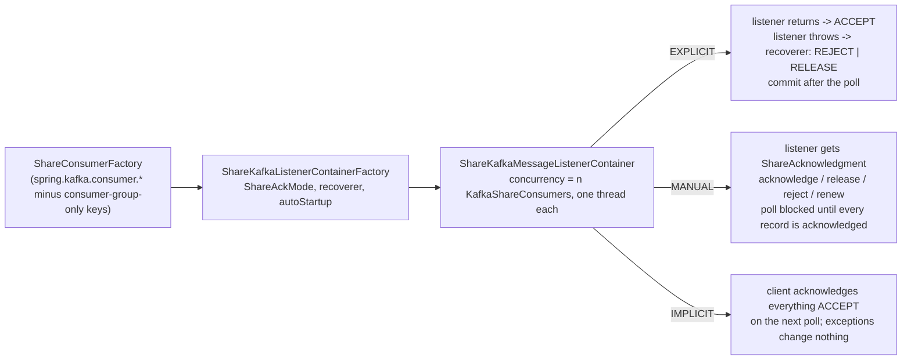

# 20 · Share consumers (queues) in Spring

**Demo:** `spring-share` · [ShareDemo.java](../spring-boot-kafka/src/main/java/io/kafkatweaks/spring/share/ShareDemo.java) · [ShareConfig.java](../spring-boot-kafka/src/main/java/io/kafkatweaks/spring/share/ShareConfig.java) · [ShareListeners.java](../spring-boot-kafka/src/main/java/io/kafkatweaks/spring/share/ShareListeners.java) · [ShareOutcomes.java](../spring-boot-kafka/src/main/java/io/kafkatweaks/spring/share/ShareOutcomes.java) · [application-spring-share.yml](../spring-boot-kafka/src/main/resources/application-spring-share.yml)

## The problem

Chapter 11 drove a `KafkaShareConsumer` by hand: poll, decide per record (`ACCEPT`, `RELEASE`, `REJECT`),
commit the acknowledgements, respect the acquisition lock. spring-kafka 4.1 wraps that loop in a
`ShareKafkaMessageListenerContainer`, so a share listener is an ordinary `@KafkaListener` with a different
container factory. Boot 4.1 has **no auto-configuration** for any of it: the `ShareConsumerFactory` and the
container factories are beans you write (a dozen lines, [ShareConfig.java](../spring-boot-kafka/src/main/java/io/kafkatweaks/spring/share/ShareConfig.java)),
and there is no `spring.kafka.share.*`. The queue semantics themselves are still **group** configs
(`share.record.lock.duration.ms`, `share.delivery.count.limit`, `share.auto.offset.reset`), set through `Admin` as
in chapter 11.

What the container adds is an acknowledgement *mode*: who calls `acknowledge()`, and when the acknowledgements
of a poll are committed. That second part is where the demo spends most of its time, because it decides how long
the acquisition lock has to be.



## The knobs

| Setting | Where | Default | Meaning |
|---|---|---|---|
| `ShareConsumerFactory` bean | `DefaultShareConsumerFactory(configs)` | none | the `KafkaShareConsumer` factory; build it from `KafkaProperties.buildConsumerProperties()` **minus** `auto.offset.reset`, `enable.auto.commit`, `isolation.level`, `group.instance.id` (consumer-group concepts; a share group has `share.auto.offset.reset` and `share.isolation.level` as *group* configs instead) |
| `ShareKafkaListenerContainerFactory` bean | `containerFactory = "..."` on the listener | none | one per acknowledgement mode you need; `setAutoStartup(false)` here, because `spring.kafka.listener.auto-startup` only reaches Boot's own factory |
| `ContainerProperties.setShareAckMode` | factory | `EXPLICIT` | `EXPLICIT`: the container sends `ACCEPT` for every record the listener returns from, and asks the `ShareConsumerRecordRecoverer` what to send when it throws. `MANUAL`: the listener takes a `ShareAcknowledgment` and must call `acknowledge()`, `release()` or `reject()` for every record. `IMPLICIT`: the client's implicit mode, everything is accepted on the next poll, exceptions change nothing |
| `setShareConsumerRecordRecoverer` | factory | `REJECTING` | `(record, exception) -> AcknowledgeType`; `RELEASING` retries every failure, a custom one can tell transient from fatal (part 3) |
| `ShareAcknowledgment` | listener parameter, `MANUAL` only | | `acknowledge()` = ACCEPT, `release()` = redeliver with `deliveryCount + 1`, `reject()` = archive, `renew()` = extend the lock (the record comes back from the next poll, see part 4); calls are queued and applied on the consumer thread |
| `setShareAcknowledgmentTimeout` | factory, `MANUAL` | 30 s | after this long an unacknowledged record is logged as a warning; nothing else happens, the consumer thread cannot poll again until it is acknowledged |
| `setSyncShareCommits` | factory | `true` | `commitSync()` after every poll; `false` = `commitAsync()` |
| `setAcknowledgementCommitCallback` | factory | none | the broker's answer to every commit (`InvalidRecordStateException` when a lock had expired); the container itself ignores commit results |
| `concurrency` | `@KafkaListener` or factory | 1 | n `KafkaShareConsumer`s in the same group, one thread each, client ids `<listener id>-0 … -n` |
| `share.record.lock.duration.ms`, `share.delivery.count.limit`, `share.auto.offset.reset` | **group** config | 30 s, 5, `latest` | as in chapter 11; `Topics.alterGroupConfigs` sets them, `Topics.deleteShareGroup` wipes a group's per-record state |
| `max.poll.records` | `spring.kafka.consumer.max-poll-records` | 500 | records one share fetch acquires; in `EXPLICIT` mode also how many locks one slow record can let expire |
| not available | | | batch listeners (rejected at startup), topic patterns and explicit partitions (unsupported), message converters, `clientIdPrefix` and `properties` on the annotation (ignored), `spring.kafka.listener.*` (the container polls with a fixed 1 s timeout), rebalance/idle/pause events |

Two log lines you will see and can ignore: at every start of an `EXPLICIT` container, `Listener is an
AcknowledgingShareConsumerAwareMessageListener but ShareAckMode.EXPLICIT is active` (the annotation adapter always
implements that interface, whether or not the method takes a `ShareAcknowledgment`), and at shutdown `Consumer stopped`
per consumer thread.

## Run it

```bash
./mvnw -q -pl spring-boot-kafka -am compile spring-boot:run -Dspring-boot.run.arguments="spring-share"
```

Arguments: `records=3000` (records seeded into `spring.queue`), `work=1` (ms of simulated work per record in part 1).
The demo deletes and re-configures its six share groups first (lock 2 s, delivery limit 3, start at `earliest`; the
`spring-share-lock-10s` group gets a 10 s lock).

## What you should see

**1. `EXPLICIT`, `concurrency = 4` on three partitions**, 3 000 records, 1 ms of work each:

```
share group spring-share-explicit: state Stable
| member (client.id = listener id + consumer index) | assigned partitions |
| share-explicit-0                                  |                 0,1 |
| share-explicit-1                                  |                   0 |
| share-explicit-2                                  |                   2 |
| share-explicit-3                                  |                 1,2 |

1. share-explicit: ... 3000 records in 6799 ms, the first one after 5188 ms
| consumer thread (one KafkaShareConsumer each) | records | from partitions                                   |
| share-explicit-C-1                            |    1092 |                                               0,1 |
| share-explicit-C-2                            |     385 |                                                 0 |
| share-explicit-C-3                            |     544 |                                                 2 |
| share-explicit-C-4                            |     979 |                                               1,2 |
| total                                         |    3000 | distinct records 3000, delivered more than once 0 |
   members the coordinator gave a partition: 4 of 4; consumers that received records: 4 of 4.
```

**2. `MANUAL`, `concurrency = 2`**: `reject()` for offsets ending in 3, `release()` once for offsets ending in 7,
and one record (`spring.queue-0@20`) that is never acknowledged:

```
share group spring-share-manual: state Stable at the first record
| share-manual-0                                    |                   0 |
| share-manual-1                                    |                 1,2 |
17:50:49.287 WARN  ShareKafkaMessageListenerContainer - Record not acknowledged within timeout (5 seconds). In ShareAckMode.MANUAL you must call
ack.acknowledge(), ack.release(), or ack.reject() for every record (call ack.renew() to extend the lock; a terminal ack is still required).
Unacknowledged record: topic='spring.queue', partition=0, offset=20

2. share-manual: ShareAckMode.MANUAL, concurrency=2: 2822 listener calls, 2560 of 3000 records reached a terminal state, 12007 ms
| the listener called                 | times | effect                                                                                                     |
| ack.acknowledge()                   |  2298 | ACCEPT: done (includes the released records on their second delivery)                                      |
| ack.release()                       |   261 | RELEASE: back to the queue, deliveryCount + 1, any member of the partition may get it                      |
| ack.reject()                        |   262 | REJECT: archived, never delivered again                                                                    |
| nothing (the bug)                   |     1 | consumer thread share-manual-C-1 never polls again; the acknowledgements of that whole poll are never sent |
| (deliveries with deliveryCount > 1) |   207 | max deliveryCount 2; distinct records delivered 2615 of 3000                                               |
| (records never delivered)           |   385 | in the partitions only the stalled thread was assigned: no other member may fetch them, lock or no lock    |

| consumer thread  | calls | partitions seen |                                                      |
| share-manual-C-1 |   545 |               0 | stalled in the poll that contained spring.queue-0@20 |
| share-manual-C-2 |  2277 |             1,2 |                                                      |
```

**3. `EXPLICIT` with a custom recoverer**, `concurrency = 2`: offsets ending in 5 throw a `TransientFailure` on their
first delivery, offsets ending in 9 throw an `IllegalStateException`:

```
3. share-recover: EXPLICIT + ShareConsumerRecordRecoverer, concurrency=2: 3300 calls for 3000 records in 5120 ms; redelivered 300, max deliveryCount 2
| listener outcome                             | times | recoverer decision            | effect                                                         |
| returned normally                            |  2700 | (none: the container ACCEPTs) | done                                                           |
| threw TransientFailure (first delivery only) |   300 | RELEASE x300                  | redelivered with deliveryCount 2, then processed               |
| threw IllegalStateException                  |   300 | REJECT x300                   | archived (the default recoverer does this for every exception) |
```

**4. Acquisition locks**: 40 records on a one-partition topic, one consumer thread, the record at offset 20 takes 3 s,
one poll acquires all 40:

```
| listener         | ack mode         | lock | listener calls | distinct records | max deliveryCount | acks committed | acks refused | renewals                | ms    |
| share-lock-2s    | EXPLICIT         |  2 s |             80 |               40 |                 2 |              0 |           80 |                       - |  8049 |
| share-lock-10s   | EXPLICIT         | 10 s |             40 |               40 |                 1 |             40 |            0 |                       - |  8043 |
| share-lock-renew | MANUAL + renew() |  2 s |             44 |               40 |                 1 |             44 |            0 | 4 (record came back 3x) | 10038 |
   refused with: InvalidRecordStateException: The record state is invalid. The acknowledgement of delivery could not be completed.
```

## Reading the numbers

- **The first record arrives after 5 s.** Share members receive their assignment through the group heartbeat
  (`group.share.heartbeat.interval.ms`, 5 s), and the container starts polling before that. Every part of the demo
  pays those 5 s once; the 3 000 records themselves took 1.6 s in part 1 (1 ms each over four threads).
- **Assignment says who *may* fetch a partition; the records go to whoever fetches first.** Every partition had two
  members and every member had a partition, so all four threads got work, unevenly (385 to 1 092). Without the 1 ms
  of work the first two consumers drain the topic before the other two send their first fetch, and with two members
  and three partitions one member regularly gets two partitions and the other one; the assignor guarantees every
  *partition* a member, not every member a partition. A fourth consumer in a consumer group would have sat idle
  every time.
- **`EXPLICIT` is chapter 11's loop with `ACCEPT` written for you.** Return = accept, throw = ask the recoverer. The
  default recoverer rejects (archives) every failed record; part 3's recoverer answers `RELEASE` for a
  `TransientFailure` (300 records came back with `deliveryCount 2` and went through) and `REJECT` for the rest
  (300 archived). Retry-with-a-counter and dead-lettering without a retry topic, as in chapter 11, but the decision
  now lives in one function instead of every listener. Note the listener's exception arrives wrapped in a
  `ListenerExecutionFailedException`: look down the cause chain.
- **`MANUAL` is a contract, and part 2 shows what breaking it costs.** One forgotten acknowledgement and the
  consumer thread that delivered it never polls again (the client refuses to poll with unacknowledged records; the
  container retries every 10 ms and warns after `shareAcknowledgmentTimeout`). Worse: the acknowledgements of that
  thread's *whole poll* (544 accept/release/reject decisions) were never sent either, they only exist client-side
  until the next poll. Their locks expire, so any *other* member of those partitions gets them back with
  `deliveryCount 2`; but partition 0 had only the stalled member, so 385 records were simply never delivered, lock or
  no lock. Liveness comes from the lock *and* from having more than one member per partition.
- **The poll is the unit of commit in `EXPLICIT` mode.** `share-lock-2s`: one 3 s record in a poll of 40 held up the
  `commitSync()` of all 40 acknowledgements past the 2 s lock. The broker refused every one of them
  (`InvalidRecordStateException`), all 40 came back with `deliveryCount 2`, and the same thing happened again: 80
  calls, 0 accepted. A third pass would follow, then `share.delivery.count.limit = 3` archives the records: processed
  three times, never acknowledged, gone. Size the lock above your slowest **poll** (`max.poll.records` × the slowest
  handler), not your slowest record; `share-lock-10s` is the same code with a 10 s lock, 40 calls, 0 refused. Smaller
  polls help too, but a single record that always outlives the lock is lost the same way.
- **`renew()` works, with the pattern the `KafkaShareConsumer` javadoc prescribes.** `share-lock-renew` hands the 3 s
  of work to a worker thread and calls `renew()` on the first delivery; a renewal is an acknowledgement, the client
  sends it with the next poll, the broker extends the lock, and **the record comes back from that poll** (same
  delivery, same `deliveryCount`), about once per container poll. Each time it is back the listener looks at the
  worker: still busy → `renew()` again, done → `acknowledge()`. Four renewals, the record came back three times,
  the broker confirmed all 44 acknowledgements (40 records + 4 renewals), nothing refused, `deliveryCount` stayed 1.
  The first version of this demo let the *worker* call `renew()` and `acknowledge()` on its own timer: between a
  renewal being sent and the record coming back the record is not in flight client-side, and an acknowledgement
  queued in that window fails with `The record cannot be acknowledged` (logged by the container, then lost). Decide
  in the listener, never from the worker.
- **The callback is how you learn what the broker thought.** The container commits and looks away; only an
  `AcknowledgementCommitCallback` (a container property) sees the `InvalidRecordStateException`s of part 4 or the
  successful renewals. Register one in production and count its failures.
- **Deleting a share group deletes its memory.** Delivery counts and archived records live in the group; the demo
  deletes its six groups first so that a previous run cannot pre-archive anything (`Topics.deleteShareGroup`, i.e.
  `Admin.deleteShareGroups`).

## When to use what

| Situation | Setting |
|---|---|
| a work queue with independent records and any number of workers | `ShareKafkaListenerContainerFactory` + `concurrency`, `EXPLICIT` mode, a recoverer that tells transient from fatal |
| the listener must decide per record (retry now, give up, done) | `MANUAL` mode with `ShareAcknowledgment`; acknowledge every record, on every path, or the consumer thread stalls |
| handlers slower than the lock | a lock ≥ `max.poll.records` × slowest handler, or `MANUAL` + worker + `renew()` on each redelivery, or fewer `max.poll.records` |
| poison records | `reject()` / a recoverer returning `REJECT`; `share.delivery.count.limit` archives what keeps failing anyway |
| a stalled member must not starve a partition | more than one member per partition (concurrency ≥ 2 × partitions is a safe rule of thumb) |
| where a new group starts, lock duration, delivery limit | group configs via `Admin.incrementalAlterConfigs` (`Topics.alterGroupConfigs`), not consumer properties |
| ordering per key, replay by offset, batch listeners, transactions | a consumer group (chapters 16–19); share containers offer none of these |
| observing commit results | `ContainerProperties.setAcknowledgementCommitCallback` |
