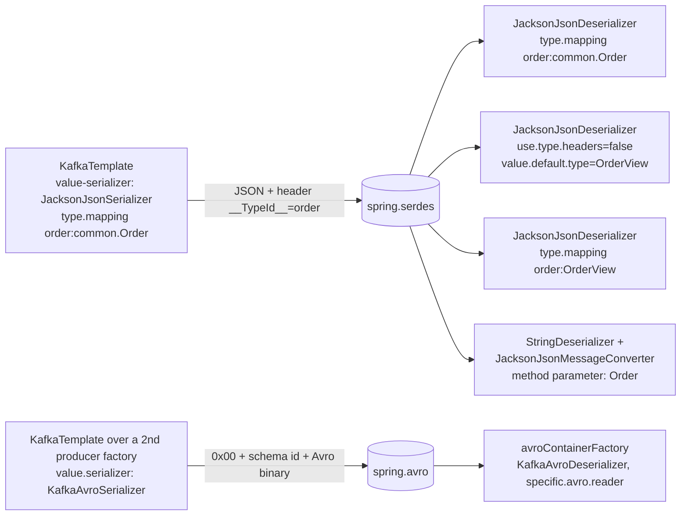

# 21 · Serialization in Spring: JSON and Avro

**Demo:** `spring-serdes` · [SerdesDemo.java](../spring-boot-kafka/src/main/java/io/kafkatweaks/spring/serdes/SerdesDemo.java) · [SerdesListeners.java](../spring-boot-kafka/src/main/java/io/kafkatweaks/spring/serdes/SerdesListeners.java) · [SerdesConfig.java](../spring-boot-kafka/src/main/java/io/kafkatweaks/spring/serdes/SerdesConfig.java) · [application-spring-serdes.yml](../spring-boot-kafka/src/main/resources/application-spring-serdes.yml)

## The problem

Chapter 13 chose the wire format (Avro + Schema Registry) and showed what it costs and what it protects. In
Spring the question shifts to wiring: the serializer is a *property* (`spring.kafka.producer.value-serializer`),
the deserializer another one, and spring-kafka ships JSON serializers of its own (Jackson 3 in 4.1:
`JacksonJsonSerializer` / `JacksonJsonDeserializer`; the Jackson 2 `JsonSerializer` family is deprecated) that put
the **type** on the wire as a header. That header is convenient and dangerous in equal measure: a consumer that
instantiates whatever class name a producer sends is a deserialization gadget, which is why the deserializer has a
trusted-packages list and why the header should carry a *token*, not a class name. This chapter shows the
producer side once, then four consumers reading the same records with different rules about who decides the type,
and finally Confluent Avro through the same `spring.kafka.*` properties.



## The knobs

| Setting | Where | Default | Meaning |
|---|---|---|---|
| `spring.kafka.producer.value-serializer` / `consumer.value-deserializer` | yml | `StringSerializer` / `StringDeserializer` | any `Serializer` / `Deserializer` class; Boot instantiates it by name and hands it the client configs, so everything below is a plain `properties` entry |
| `JacksonJsonSerializer` | producer | | Jackson 3, java.time and `BigDecimal` out of the box; adds `__TypeId__` (`spring.json.add.type.headers`, default `true`) |
| `spring.json.type.mapping` | both sides | none | `token:class,...`; the header carries the token; each consumer maps it to *its* class. The one setting that decouples producer and consumer code |
| `spring.json.trusted.packages` | consumer | `java.util`, `java.lang` | the only packages the deserializer may instantiate from a header; `*` trusts everything (never in production) |
| `spring.json.use.type.headers` | consumer | `true` | `false`: ignore the header, always use `spring.json.value.default.type` |
| `spring.json.value.default.type` | consumer | none | the type when there is no header (or the header is ignored) |
| `spring.json.remove.type.headers` | consumer | `true` | the deserializer **removes** `__TypeId__` after reading it; listeners see no header unless you set this to `false` |
| `@KafkaListener(properties = "spring.json...:...")` | listener | | per-consumer overrides of the deserializer's settings: several listeners, one consumer factory, different types (`key:value` syntax, colon) |
| `JacksonJsonMessageConverter` | container factory | none | the other wiring: `StringDeserializer` + conversion in the listener adapter, driven by the **method parameter type** (`TypePrecedence.INFERRED`); `@KafkaHandler` methods on a class-level listener dispatch by type |
| `ErrorHandlingDeserializer` + `spring.deserializer.value.delegate.class` | consumer | | the wrapper that turns a poison pill into a `DeserializationException` for the error handler instead of a dead poll loop (chapter 18) |
| `DelegatingByTypeSerializer` / `DelegatingByTopicSerializer` | producer | | one template, several value types or topics with different formats (chapter 18's dead-letter template uses the first) |
| `KafkaAvroSerializer` / `KafkaAvroDeserializer` + `spring.kafka.properties[schema.registry.url]`, `consumer.properties[specific.avro.reader]`, `producer.properties[auto.register.schemas]` | both | | chapter 13's serializers, configured through the same maps; `AvroTrust.trustGeneratedClasses()` before the first Avro send (the serializer resolves the class too) |
| a second producer/consumer factory | code | | formats differ per topic: build the factory from `KafkaProperties.buildProducerProperties()` / `buildConsumerProperties()` with the serializer swapped, and a container factory through Boot's `ConcurrentKafkaListenerContainerFactoryConfigurer` so `spring.kafka.listener.*` still applies. Extra `KafkaTemplate`s stay non-beans (chapter 15) |

## Run it

```bash
./mvnw -q -pl spring-boot-kafka -am compile spring-boot:run -Dspring-boot.run.arguments="spring-serdes"
```

Arguments: `records=1000`.

## What you should see

**1. JSON out**, the auto-configured template with `value-serializer: JacksonJsonSerializer` and a producer-side
type mapping:

```
the first record on the wire: headers [__TypeId__=order], value 126 bytes:
{"orderId":"ORD-8","customerId":"customer-8","totalAmount":8.18,"currency":"EUR","createdAt":"2026-09-22T15:00:58.930360100Z"}
```

**2. JSON in, four listeners on the same 1 000 records:**

```
| listener         | how the value type is decided                                                     | value class in the listener            | __TypeId__ header | first value                                |
| serdes-json      | JacksonJsonDeserializer: header token -> spring.json.type.mapping (yml)           | io.kafkatweaks.common.Order            | (none)            | Order[orderId=ORD-8, customerId=customer-8, totalAmount=8.18, curre... |
| serdes-view      | spring.json.use.type.headers=false + value.default.type (per-listener properties) | io.kafkatweaks.spring.serdes.OrderView | (none)            | OrderView[orderId=ORD-1, totalAmount=1.11] |
| serdes-mapped    | spring.json.type.mapping=order:OrderView (per-listener properties)                | io.kafkatweaks.spring.serdes.OrderView | (none)            | OrderView[orderId=ORD-8, totalAmount=8.18] |
| serdes-converter | StringDeserializer + JacksonJsonMessageConverter: the method parameter's type     | io.kafkatweaks.common.Order            | order             | Order[orderId=ORD-0, customerId=customer-0, totalAmount=0.10, curre... |
```

**3. Avro out** through a second producer factory built from `spring.kafka.producer.*`:

```
FAILED before AvroTrust: SecurityException: Forbidden io.kafkatweaks.avro.generated.Order! This class is not trusted to be included in Avro schemas. ...
after AvroTrust.trustGeneratedClasses(): 1000 records sent; registered subject spring.avro-value, schema id 8, version 1
```

**4. Avro in** with `specific.avro.reader=true`, and the wire sizes:

```
| listener    | how the value type is decided                                                               | value class in the listener         | __TypeId__ header | first value                                        |
| serdes-avro | KafkaAvroDeserializer + specific.avro.reader=true: schema id -> registry -> generated class | io.kafkatweaks.avro.generated.Order | (none)            | {"orderId": "ORD-0", "customerId": "customer-0", "totalAmount": 0.1... |

| format                               | value bytes/record | header bytes/record | what is on the wire                                                          |
| JSON (JacksonJsonSerializer)         |              129.0 |                15.0 | field names + values as text; __TypeId__ header with the mapped token        |
| Confluent Avro (KafkaAvroSerializer) |               37.4 |                 0.0 | magic byte 0x00 + 4-byte schema id + Avro binary, no field names, no headers |
subjects in the registry for spring.* topics: spring.avro-value
```

## Reading the numbers

- **The header is the contract, and a token is the right contract.** Without `spring.json.type.mapping` the
  producer writes `__TypeId__=io.kafkatweaks.common.Order`: its Java class name, on the wire, forever. Every consumer
  then either has that exact class or configures its way around it. With the mapping the header says `order`, and
  `serdes-json`, `serdes-mapped` and `serdes-converter` each turned that into the class *they* wanted. The
  consumer-side mapping is the half most teams forget; without it the token is an unknown class name and every
  record is a deserialization error.
- **Three ways for the consumer to decide.** `serdes-view` ignores headers entirely (`use.type.headers=false` +
  `value.default.type`): the choice for a topic with one type, and immune to whatever a producer sends.
  `serdes-mapped` keeps the header, useful when a topic carries several types, and maps the token to a local class.
  `serdes-converter` moves conversion out of the Kafka deserializer into the listener adapter: values are
  `String`s until the method is called, the method's parameter type (`Order`) wins (`TypePrecedence.INFERRED`), and
  a class-level `@KafkaListener` with `@KafkaHandler` methods can dispatch a mixed topic by type. It is also the only
  one of the four that still *saw* the header: the deserializer removes `__TypeId__` after using it
  (`spring.json.remove.type.headers=true`), the converter does not touch the record.
- **Per-listener `properties` beats a factory per type.** `serdes-view` and `serdes-mapped` share Boot's consumer
  factory; the annotation's `properties` are merged into the consumer configs, and since Boot instantiates the
  deserializer by class name inside the consumer, each container gets a `JacksonJsonDeserializer` configured its own
  way. A second factory is only needed when the deserializer *class* changes (`serdes-converter`, `serdes-avro`).
- **`OrderView` proves the schema-evolution point of chapter 13 for JSON.** The consumer's record has two of the
  five fields; Jackson (as spring-kafka configures it) ignores unknown properties, so the consumer keeps working when
  the producer adds fields. Removing or renaming one still breaks it silently (`null`), which is what the registry
  would have refused in chapter 13.
- **Avro through Spring is chapter 13 with the properties moved.** `schema.registry.url` sits once under
  `spring.kafka.properties` and reaches both the serializer (second producer factory) and the deserializer
  (`avroContainerFactory`), because both factories are built from the same `KafkaProperties`. The failure-first send
  is the same `SecurityException` as in chapter 13: Avro ≥ 1.12.1 refuses untrusted classes on the *serializer* side
  too, so `AvroTrust.trustGeneratedClasses()` belongs before the first send, not just before the first read. An
  Avro-only service needs none of the extra factories: the four commented lines at the end of the yml put the
  Confluent classes on Boot's default factories.
- **129 + 15 bytes versus 37.4.** The same order data: JSON with its field names and the type header is 3.9× the
  Avro record, whose only overhead is the 5-byte schema-id prefix. Chapter 13's numbers, reproduced through Spring.
- **Keys are still strings.** Nothing here touched `key-serializer`; keys have their own `__KeyTypeId__` header and
  `spring.json.key.default.type` if you ever serialize them as JSON, which is rarely a good idea (partitioning by the
  bytes of a JSON document is fragile).

## When to use what

| Situation | Setting |
|---|---|
| Spring services on both ends, one type per topic | `JacksonJsonSerializer` / `JacksonJsonDeserializer`, `spring.json.type.mapping` with a token on both sides, `trusted.packages` to your own packages |
| a consumer that must not depend on the producer's classes at all | `spring.json.use.type.headers=false` + `spring.json.value.default.type=<your class>` |
| several event types on one topic | tokens in `type.mapping` + `@KafkaHandler` methods behind a `JacksonJsonMessageConverter`, or `ConsumerRecord<String, Object>` with the mapped deserializer |
| the same consumer factory, different types per listener | `@KafkaListener(properties = "spring.json...:...")` |
| a different serializer *class* for some topics | a second producer / consumer factory from `KafkaProperties.build*Properties()`, container factory via Boot's configurer, non-bean `KafkaTemplate` |
| a contract checked at registration, compact records, non-Spring consumers | Confluent Avro (chapter 13): `KafkaAvroSerializer` / `KafkaAvroDeserializer` through `spring.kafka.*.properties`, `auto.register.schemas=false` in production, `AvroTrust` before the first send |
| records that may not deserialize | `ErrorHandlingDeserializer` around the real one (chapter 18) |
| the listener wants to see `__TypeId__` | `spring.json.remove.type.headers=false`, or the converter wiring |
