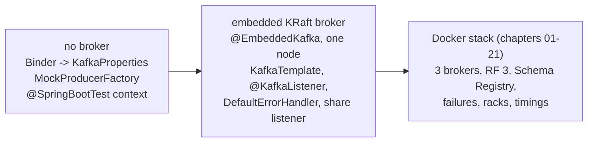

# 22 · Testing Spring Kafka applications

**Tests (the module's test suite):** [KafkaPropertiesMappingTest](../spring-boot-kafka/src/test/java/io/kafkatweaks/spring/KafkaPropertiesMappingTest.java) · [MockProducerFactoryTest](../spring-boot-kafka/src/test/java/io/kafkatweaks/spring/txn/MockProducerFactoryTest.java) · [ContextLoadsTest](../spring-boot-kafka/src/test/java/io/kafkatweaks/spring/ContextLoadsTest.java) · [TemplateListenerRoundTripTest](../spring-boot-kafka/src/test/java/io/kafkatweaks/spring/TemplateListenerRoundTripTest.java) · [DeadLetterTest](../spring-boot-kafka/src/test/java/io/kafkatweaks/spring/errors/DeadLetterTest.java) · [ShareListenerTest](../spring-boot-kafka/src/test/java/io/kafkatweaks/spring/share/ShareListenerTest.java) · [TweaksSpringTest](../spring-boot-kafka/src/test/java/io/kafkatweaks/spring/TweaksSpringTest.java) · [DemoProfilesTest](../spring-boot-kafka/src/test/java/io/kafkatweaks/spring/DemoProfilesTest.java) · [application-test.yml](../spring-boot-kafka/src/test/resources/application-test.yml) · **Recipe:** the tests themselves

## The problem

Every chapter so far ran against the Docker stack, which is the right place to *learn* what a knob does and the
wrong place for a build to depend on. This chapter has no demo; it is the module's test suite, in three layers:
tests that need no broker (property binding, a service over a mock producer, the context itself), tests on a
one-node **KRaft broker started inside the JVM** by `spring-kafka-test` (template → listener, error handler → dead
letter, a share listener), and the Docker stack for everything the other two cannot show (three replicas, a broker
dying, rack awareness, real latencies). Each layer has a trap or two that cost this repository a failed run, listed
under "Reading the numbers".



## The tools

| Tool | Needs | What it is for |
|---|---|---|
| `Binder` + `MapConfigurationPropertySource` → `KafkaProperties` | nothing | prove that a `spring.kafka.*` property becomes the client config you think it does, with Boot's own conversion (`64KB` → `65536`, `250ms` → `250`) |
| `MockProducerFactory` + `KafkaTemplate` + kafka-clients' `MockProducer` | nothing | unit-test a service that sends: `history()` holds every `ProducerRecord` |
| `@SpringBootTest` with `spring.kafka.admin.auto-create=false` (`@TweaksSpringTest`) | nothing | the wiring is valid Spring configuration; Boot's template and admin connect lazily |
| `@EmbeddedKafka(partitions, topics, bootstrapServersProperty = "spring.kafka.bootstrap-servers")` | `spring-boot-starter-kafka-test` (pulls `kafka-server`, ~100 MB) | a KRaft broker in the test JVM (ZooKeeper mode is gone); the property points Boot at it |
| nested `@TestConfiguration` classes | | test-scoped `@KafkaListener`s, error handlers, extra factories, without touching `src/main` |
| `KafkaListenerEndpointRegistry` + `ContainerTestUtils.waitForAssignment` | | start a listener (auto-startup is off in this module) and wait until it owns its partitions |
| `KafkaTestUtils.consumerProps/producerProps/getSingleRecord/getRecords`, `EmbeddedKafkaBroker.consumeFromAnEmbeddedTopic` | | read what a listener or a recoverer produced, without another listener |
| `@DirtiesContext` | | close the context (and its broker) after the class; every embedded test class here has different topics anyway |
| `brokerProperties = {...}` on `@EmbeddedKafka` | | broker settings the one-node cluster needs (the share coordinator's topic below) |
| Testcontainers (`org.testcontainers:kafka`) | Docker | the alternative when the test must run the real image; not used here by decision: the Docker stack already exists for that |

## The code that matters

Here the tests are the recipes. A listener, an error handler and a dead-letter topic on a broker inside the JVM, from
[DeadLetterTest.java](../spring-boot-kafka/src/test/java/io/kafkatweaks/spring/errors/DeadLetterTest.java):

<!-- recipe: spring-boot-kafka/src/test/java/io/kafkatweaks/spring/errors/DeadLetterTest.java -->
```java
@TweaksSpringTest
@EmbeddedKafka(partitions = 1, topics = {DeadLetterTest.TOPIC, DeadLetterTest.TOPIC + "-dlt"}, bootstrapServersProperty = "spring.kafka.bootstrap-servers")
@DirtiesContext
class DeadLetterTest {
    // ...
    @Bean
    DefaultErrorHandler errorHandler(KafkaTemplate<?, ?> template) {
        // 1 attempt + 2 retries without a pause, then recover: publish to test.errors-dlt (same partition).
        return new DefaultErrorHandler(new DeadLetterPublishingRecoverer(template), new FixedBackOff(0, 2));
    }
    // ...
    MessageListenerContainer container = registry.getListenerContainer("test-failing");
    container.start();
    ContainerTestUtils.waitForAssignment(container, 1);
```

and every demo profile wired without a broker, from
[DemoProfilesTest.java](../spring-boot-kafka/src/test/java/io/kafkatweaks/spring/DemoProfilesTest.java):

<!-- recipe: spring-boot-kafka/src/test/java/io/kafkatweaks/spring/DemoProfilesTest.java -->
```java
try (ConfigurableApplicationContext context = new SpringApplicationBuilder(SpringTweaksApplication.class)
        .profiles(profile, "test")
        .properties("tweaks.demo.run=false")
        .run()) {
    assertThat(context.getBean(KafkaListenerEndpointRegistry.class).getListenerContainerIds())
            .containsExactlyInAnyOrderElementsOf(listenerIds);
```

- **`@EmbeddedKafka(bootstrapServersProperty = "spring.kafka.bootstrap-servers")`** points Boot's whole auto-configuration
  at the in-JVM broker; the `DefaultErrorHandler` **bean** is enough for Boot to wire it into its container factory.
- **Start containers yourself and wait for the assignment** (`ContainerTestUtils.waitForAssignment`): auto-startup is
  off in this module, and a record sent before the consumer owns its partition makes the test pass by luck.
- **A context per profile, no broker**: the `test` profile keeps `KafkaAdmin` from creating topics, containers do not
  start, and every `containerFactory = "..."` name, `@Profile` string and listener id is checked in 3 s.

## Run it

```bash
./mvnw -q -pl spring-boot-kafka -am verify
```

No Docker needed. `./mvnw -q verify` at the root runs all three modules (plain unit tests included).

## What you should see

```
Tests run: 1, Failures: 0, Errors: 0, Skipped: 0, Time elapsed: 2.716 s -- in io.kafkatweaks.spring.ContextLoadsTest
Tests run: 10, Failures: 0, Errors: 0, Skipped: 0, Time elapsed: 2.405 s -- in io.kafkatweaks.spring.DemoProfilesTest
Tests run: 1, Failures: 0, Errors: 0, Skipped: 0, Time elapsed: 5.626 s -- in io.kafkatweaks.spring.errors.DeadLetterTest
Tests run: 4, Failures: 0, Errors: 0, Skipped: 0, Time elapsed: 0.010 s -- in io.kafkatweaks.spring.errors.FailureScriptTest
Tests run: 4, Failures: 0, Errors: 0, Skipped: 0, Time elapsed: 0.010 s -- in io.kafkatweaks.spring.KafkaPropertiesMappingTest
Tests run: 1, Failures: 0, Errors: 0, Skipped: 0, Time elapsed: 7.056 s -- in io.kafkatweaks.spring.share.ShareListenerTest
Tests run: 1, Failures: 0, Errors: 0, Skipped: 0, Time elapsed: 2.961 s -- in io.kafkatweaks.spring.TemplateListenerRoundTripTest
Tests run: 2, Failures: 0, Errors: 0, Skipped: 0, Time elapsed: 0.018 s -- in io.kafkatweaks.spring.txn.MockProducerFactoryTest
Tests run: 24, Failures: 0, Errors: 0, Skipped: 0

spring-boot-kafka .................................. SUCCESS [ 24.675 s]
```

(`./mvnw verify` without `-q` prints the lines; the whole module, embedded brokers included, takes about 25 s on a
laptop, most of it JVM, context and broker start-up. `DemoProfilesTest`'s nine contexts, the eight chapters and the
catalogue, take 2.4 s together.)

## Reading the numbers

- **`KafkaPropertiesMappingTest` is chapter 14's table, executable.** `new Binder(new MapConfigurationPropertySource(map)).bind("spring.kafka", KafkaProperties.class)`
  is exactly what Boot does with `application.yml`; `buildProducerProperties()` is exactly what the factory
  receives. Two findings worth the test: `spring.kafka.properties` reaches producer, consumer and admin, and a
  per-client `properties` entry beats it; and a free-form `producer.properties[acks]` beats the typed
  `producer.acks` for the same config, because Boot applies the typed keys first and the map last. Say a knob once.
- **`MockProducerFactoryTest`: `KafkaTemplate` closes the producer after every send.** A `DefaultKafkaProducerFactory`
  producer ignores that (it returns to the cache); a `MockProducer` really closes and the second send throws
  `MockProducer is already closed`. The test's `RecordingProducer` overrides `close(Duration)` and keeps its
  `history()`. Also note what a unit test *cannot* show: `OrderTransfer` is `@Transactional`, and without a
  transaction manager around the call the three records of the failing transfer are simply sent; the rollback is
  chapter 19's demo.
- **`ContextLoadsTest` costs nothing, and covers exactly the *shared* wiring**: `application.yml` binding,
  `TopicsConfig`, `DemoSupport`, `ClientCapture`, and the fact that Boot's `KafkaTemplate`/`ProducerFactory`/
  `KafkaAdmin` are still the single beans the demos expect. It works without a broker because Boot's template
  connects lazily and `application-test.yml` turns `KafkaAdmin`'s topic creation off (the `TopicsConfig` topics are
  RF 3, a one-node broker would refuse them anyway) and `fail-fast` too. Know its limit: it activates no demo
  profile, which is what `assertThat(registry.getListenerContainerIds()).isEmpty()` records, so none of the eight
  chapter configurations is instantiated there.
- **`DemoProfilesTest` covers the eight chapter configurations the same way, one context per `Catalogue` profile.**
  Without it, a typo in a `containerFactory` name, a renamed factory `@Bean` or a misspelled `@Profile` string would
  pass the suite and only fail with `NoSuchBeanDefinitionException` when that demo is run. It starts
  `SpringTweaksApplication` with `<profile>,test` and `tweaks.demo.run=false` (`DemoSupport` then hands out a no-op
  runner instead of the demo body) and asserts the exact listener container ids, the `@RetryableTopic` ones
  (`errors-retryable-retry-1000` … `errors-retryable-dlt`) included. It is what made moving the beans into the
  `recipe` packages safe. Its last test starts the `catalogue` profile (a run without a demo name, which lists the
  demos) without the `test` profile and with `spring.kafka.bootstrap-servers=localhost:1`: the list must never need
  a broker, and `application-catalogue.yml` alone has to guarantee that.
- **`TemplateListenerRoundTripTest`: start the container yourself.** `spring.kafka.listener.auto-startup=false`
  (application.yml, chapter 16) applies to tests as well, so the test starts the container from the registry and
  waits with `ContainerTestUtils.waitForAssignment(container, 3)` before sending; without the wait the first records
  can arrive before the consumer has partitions and, with `auto-offset-reset=earliest`, still be found, but that is
  luck, not a test. `KafkaTestUtils.consumerProps(...)` configures an **`IntegerDeserializer` for keys**: override
  `key.deserializer` for String keys or the read-back fails with `RecordDeserializationException`.
- **`DeadLetterTest`: a `DefaultErrorHandler` bean is enough.** Boot wires a single `CommonErrorHandler` bean into
  its container factory, so a nested `@TestConfiguration` with `new DefaultErrorHandler(new DeadLetterPublishingRecoverer(template), new FixedBackOff(0, 2))`
  gives the failing listener three attempts and a dead-letter record in `test.errors-dlt`, with
  `kafka_dlt-original-topic`, `kafka_dlt-exception-fqcn` (Spring's `ListenerExecutionFailedException`),
  `kafka_dlt-exception-cause-fqcn` (the real `IllegalStateException`) and the message, as in chapter 18. Both topics
  are created by `@EmbeddedKafka(topics = ...)` with the same partition count, since the recoverer publishes to the
  same partition.
- **`ShareListenerTest`: two traps, one per layer.** Spring: a `@KafkaListener` that names its `containerFactory` is
  resolved while its own bean is being created, so the factory cannot be a `@Bean` method of the same
  `@TestConfiguration` class (`BeanCurrentlyInCreationException`); the test has one class for the factories and one
  for the listener. Broker: the embedded 4.2.1 broker is formatted with `share.version=1`, but the share coordinator
  keeps its state in `__share_group_state` with replication factor 3, and `spring-kafka-test` lowers only the offsets
  topic's factor to the broker count, so a one-node cluster logs `INVALID_REPLICATION_FACTOR` every few seconds and the
  listener never receives anything; `brokerProperties = {"share.coordinator.state.topic.replication.factor=1", "share.coordinator.state.topic.min.isr=1"}`
  fixes it. The group is set to `share.auto.offset.reset=earliest` through `Admin` first, because the records are
  sent before the member has its assignment (chapter 20: up to 5 s).
- **What the embedded broker cannot tell you**: anything about replication (`acks=all` with one replica is
  `acks=1`), `min.insync.replicas`, a broker going away, rack-aware fetching, and honest latencies (everything is in
  one JVM). Those stay with the Docker stack, i.e. with the demos; a CI job that needs them runs the stack or
  Testcontainers.

## When to use what

| Situation | Setting |
|---|---|
| "does this yml do what I think" | `Binder` → `KafkaProperties` → `build*Properties()`, assert the client keys |
| a service that only sends | `MockProducerFactory` with a `MockProducer` whose `close(Duration)` is a no-op; assert `history()` |
| the wiring itself (factories, profiles, listener ids) | `@SpringBootTest` with `spring.kafka.admin.auto-create=false` and `fail-fast=false`, no broker; one `SpringApplicationBuilder` context per profile for profile-specific beans |
| listener logic end to end, error handlers, dead letters, share listeners | `@EmbeddedKafka` + `bootstrapServersProperty`, test-scoped `@TestConfiguration` listeners, start containers from the registry, `KafkaTestUtils` to read back, `@DirtiesContext` |
| a share listener on the embedded broker | `brokerProperties` lowering `share.coordinator.state.topic.replication.factor` and `min.isr` to 1; group config `share.auto.offset.reset=earliest` |
| replication, failures, racks, real timings | the Docker stack (`docker compose up -d --wait`) or Testcontainers; that is what the demos are |
| keeping the suite fast | one context per embedded test class, few topics, no `Thread.sleep`: latches and `KafkaTestUtils.getSingleRecord` with a timeout |
