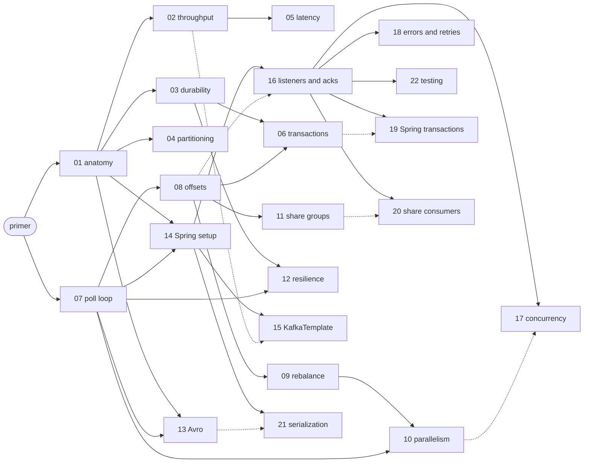

# Docs index

Every chapter is one tweak: a short write-up, a runnable demo (`./demo NN`) that logs the numbers the tweak moves,
and a recipe class with the code to copy. Chapters carry a level so you can tell the essentials from the deep dives:

- **Essentials**: what every developer who touches Kafka should know.
- **Practitioner**: what you need once the service runs in production.
- **Deep dive**: specific needs (exactly-once, queues); read when you need them.

## Start here

| | |
|---|---|
| [Primer · Kafka in 20 minutes](primer.md) | brokers, partitions, offsets, replicas, groups, commits: the words every chapter uses |
| [00 · Setup and how to run a chapter](00-setup.md) | the Docker stack, `./demo NN`, the shared helpers |
| [Glossary](glossary.md) | one line per term, with the chapter that explains it |

## Learning paths

Pick the path that matches you; each arrow is "read this first".

| You are… | Path |
|---|---|
| **New to Kafka** | [primer](primer.md) → [01](01-producer-baseline.md) → [02](02-producer-batching-compression.md) → [03](03-producer-durability.md) → [07](07-consumer-fetch.md) → [08](08-consumer-offsets.md), then on Spring: [14](14-spring-boot-setup.md) → [15](15-spring-kafkatemplate.md) → [16](16-spring-listeners-acks.md) |
| **A Spring developer who has used Kafka a bit** | skim the [primer](primer.md) → [01](01-producer-baseline.md) → [03](03-producer-durability.md) → [08](08-consumer-offsets.md) → [14](14-spring-boot-setup.md) → [15](15-spring-kafkatemplate.md) → [16](16-spring-listeners-acks.md) → [18](18-spring-error-handling-retry.md) → [17](17-spring-concurrency-batch.md) |
| **Tuning a system that already runs** | [02](02-producer-batching-compression.md), [04](04-producer-partitioning.md), [05](05-producer-low-latency.md), [07](07-consumer-fetch.md), [09](09-consumer-rebalance.md), [10](10-consumer-parallel.md), [12](12-client-resilience.md) and the [cheat sheet](cheatsheet.md) |
| **After exactly-once or queue semantics** | [03](03-producer-durability.md) → [06](06-producer-transactions.md) → [19](19-spring-transactions.md); [08](08-consumer-offsets.md) → [11](11-consumer-share-groups.md) → [20](20-spring-share-consumers.md) |

The same prerequisites as a graph (solid: read first; dotted: the Spring version of a plain chapter):

## Part 1 · Plain Kafka clients (`plain-clients`)

| # | Chapter | Level | Demo |
|---|---|---|---|
| 01 | [Producer anatomy, defaults and metrics](01-producer-baseline.md) | Essentials | `./demo 01` |
| 02 | [Throughput: batching and compression](02-producer-batching-compression.md) | Essentials | `./demo 02` |
| 03 | [Durability, ordering and retries](03-producer-durability.md) | Essentials | `./demo 03` |
| 04 | [Partitioning and keys](04-producer-partitioning.md) | Practitioner | `./demo 04` |
| 05 | [Latency first](05-producer-low-latency.md) | Practitioner | `./demo 05` |
| 06 | [Transactions and exactly-once](06-producer-transactions.md) | Deep dive | `./demo 06` |
| 07 | [The poll loop and fetch tuning](07-consumer-fetch.md) | Essentials | `./demo 07` |
| 08 | [Offsets and delivery guarantees](08-consumer-offsets.md) | Essentials | `./demo 08` |
| 09 | [Group protocol and rebalancing](09-consumer-rebalance.md) | Practitioner | `./demo 09` |
| 10 | [Scaling and parallelism](10-consumer-parallel.md) | Practitioner | `./demo 10` |
| 11 | [Queues for Kafka: share groups](11-consumer-share-groups.md) | Deep dive | `./demo 11` |
| 12 | [Client resilience and operations](12-client-resilience.md) | Practitioner | `./demo 12` |
| 13 | [Schema Registry and Avro](13-avro-schema-registry.md) | Practitioner | `./demo 13` |

## Part 2 · Spring Boot (`spring-boot-kafka`)

| # | Chapter | Level | Plain-client version | Demo |
|---|---|---|---|---|
| 14 | [Spring Boot wiring and the `spring.kafka.*` mapping](14-spring-boot-setup.md) | Essentials | 01–13 | `./demo 14` |
| 15 | [KafkaTemplate](15-spring-kafkatemplate.md) | Essentials | [01](01-producer-baseline.md), [02](02-producer-batching-compression.md), [05](05-producer-low-latency.md) | `./demo 15` |
| 16 | [`@KafkaListener` and acknowledgment modes](16-spring-listeners-acks.md) | Essentials | [08](08-consumer-offsets.md) | `./demo 16` |
| 17 | [Concurrency, batch listeners and back-pressure](17-spring-concurrency-batch.md) | Practitioner | [07](07-consumer-fetch.md), [10](10-consumer-parallel.md) | `./demo 17` |
| 18 | [Error handling, retries, dead letters and `@RetryableTopic`](18-spring-error-handling-retry.md) | Practitioner | [08](08-consumer-offsets.md) | `./demo 18` |
| 19 | [Transactions in Spring](19-spring-transactions.md) | Deep dive | [06](06-producer-transactions.md) | `./demo 19` |
| 20 | [Share consumers (queues) in Spring](20-spring-share-consumers.md) | Deep dive | [11](11-consumer-share-groups.md) | `./demo 20` |
| 21 | [Serialization in Spring: JSON and Avro](21-spring-serialization.md) | Practitioner | [13](13-avro-schema-registry.md) | `./demo 21` |
| 22 | [Testing Spring Kafka applications](22-spring-testing.md) | Practitioner | – | `./demo 22` (the test suite) |

## Reference

- [Cheat sheet](cheatsheet.md): goal → knob → metric → cost on one page, and plain config → `spring.kafka.*`.
- [Recipes](recipes.md): every recipe class with what it bought in its demo.
- [Glossary](glossary.md).

On Windows use `.\demo.cmd NN` (PowerShell) or `demo.cmd NN` (cmd.exe) instead of `./demo NN`.
