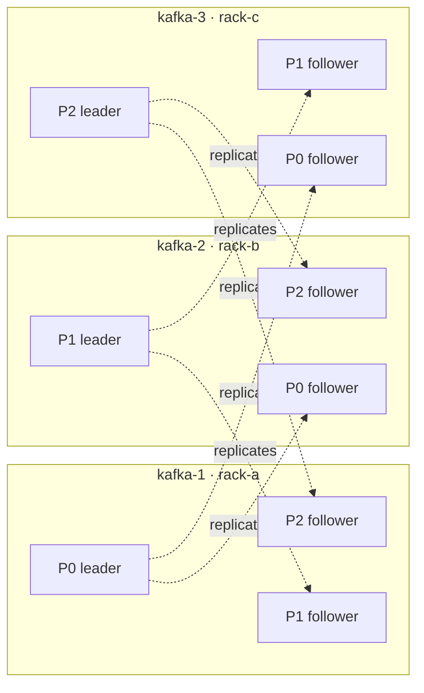
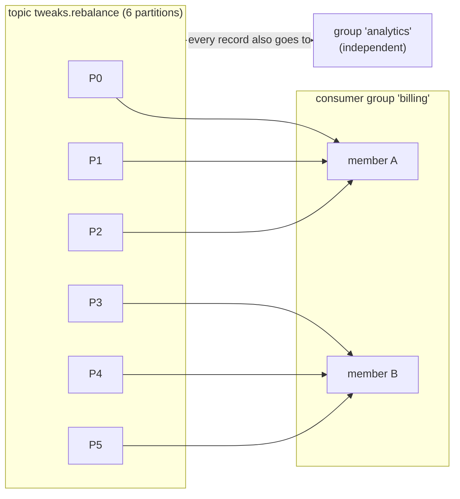

# Primer · Kafka in 20 minutes

The chapters assume a handful of words: partition, offset, leader, ISR, consumer group, commit. This page explains
each of them once, with the cluster this repository starts, so the chapters can get straight to the tuning. If you
already use Kafka every day, skim the headings and go to [01](01-producer-baseline.md). Every section ends with the
chapter that goes deep, and the [glossary](glossary.md) has one-line definitions of everything else.

Start the stack first ([00 · Setup](00-setup.md)) and keep Kafbat UI open at http://localhost:8080: every concept
below is something you can click on there.

## 1. Brokers and the cluster

A **broker** is one Kafka server process. Several brokers form a **cluster**; clients connect to any of them (the
`bootstrap.servers` list), learn from it where everything lives (**metadata**), and then talk directly to the broker
that owns the data they need. Since Kafka 4.0 the cluster manages itself with **KRaft** (a Raft quorum of controller
processes); ZooKeeper is gone.

This repository runs three brokers, `kafka-1`, `kafka-2` and `kafka-3`, each in its own "rack" (`rack-a/b/c`),
reachable from your machine at `localhost:19092`, `29092` and `39092`. Each one is also a KRaft controller; the quorum
needs 2 of 3, so you can stop one broker safely, never two.

**See it:** Kafbat UI → *Brokers*. **Goes deep in:** [12](12-client-resilience.md) (racks, a broker dying).

## 2. Topics and records

A **topic** is a named stream of records, like a table name for events: `tweaks.batching`, `orders`, `payments`.
A **record** (also called message or event) has a **key** (optional, bytes), a **value** (bytes), a **timestamp** and
optional **headers**. Kafka stores bytes only: turning your objects into bytes is the job of a **serializer** on the
producer side and a **deserializer** on the consumer side (strings and JSON here; Avro in [13](13-avro-schema-registry.md)).

Reading a record does not remove it. Records stay until the topic's **retention** (time or size) expires, so any
number of applications can read the same topic independently, and one application can re-read it.

This stack disables automatic topic creation on purpose: a typo in a topic name fails loudly instead of creating a
new topic. The `topic-init` container creates the `tweaks.*` topics with deliberate partition counts.

**See it:** Kafbat UI → *Topics* → `tweaks.baseline` → *Messages* (after running [01](01-producer-baseline.md)).

## 3. Partitions

A topic is split into **partitions**, numbered from 0. Each partition is an append-only log that lives on a broker.
Partitions are the unit of everything that matters for tuning:

- **Parallelism.** Different partitions can be written and read by different machines at the same time. A topic with
  3 partitions can be consumed by at most 3 consumers of one group in parallel ([10](10-consumer-parallel.md)).
- **Ordering.** Kafka keeps order **within a partition only**. Records with the same key go to the same partition
  (the key is hashed), so per-key order is kept; there is no order across partitions ([04](04-producer-partitioning.md)).
- **Batching.** The producer batches per partition ([02](02-producer-batching-compression.md)).

**Goes deep in:** [04](04-producer-partitioning.md).

## 4. Offsets

Every record in a partition gets a sequential number, its **offset**: 0, 1, 2, … A record is identified by
topic + partition + offset. Consumers track their position as "the next offset to read" per partition, and that
position is all a consumer needs to resume after a restart.

```
tweaks.orders, partition 0:   [0][1][2][3][4][5][6][7]  ← producers append here
                                          ▲
                                          a consumer's position: next read is offset 4
```

**Goes deep in:** [08](08-consumer-offsets.md) (committing and seeking).

## 5. Replicas, leaders and the ISR

Each partition is copied to several brokers: the topic's **replication factor** (RF). Here every topic has RF=3, so
every partition exists on all three brokers. One copy is the **leader** (it takes the writes), the others are
**followers** that fetch from it. The followers that are caught up form the **in-sync replica set (ISR)**. If the
leader's broker dies, a follower from the ISR becomes the new leader and clients carry on.



*A 3-partition topic with RF=3 on this stack: leaders spread over the brokers, every broker holds a copy of everything.*

Two settings decide how safe a write is. The producer's **`acks`** says when the leader may answer: `0` (don't wait),
`1` (the leader has it) or `all` (every ISR member has it; the default). The topic's **`min.insync.replicas`** (2 here)
says how small the ISR may get before `acks=all` writes are refused. Together, `acks=all` + `min.insync.replicas=2`
means an acknowledged record is on at least two brokers.

**See it:** Kafbat UI → *Topics* → any `tweaks.*` topic → *Overview*: leader and replicas per partition, and the ISR.
**Goes deep in:** [03](03-producer-durability.md).

## 6. The producer

`KafkaProducer.send(record)` does not send anything over the network by itself. It serializes the record, picks a
partition, and appends it to a **batch** for that partition in an in-memory buffer (the **accumulator**). A background
**sender thread** ships full batches (or batches that waited `linger.ms`) to the partition leaders, and when the
broker acknowledges, your **callback** runs. So `send()` is asynchronous, and the callback is the only place a failed
write shows up.

```
send() → serializer → partitioner → accumulator (a batch per partition) → sender thread → leader broker
                                                                                 ↓ ack
                                                                             callback
```

**Goes deep in:** [01](01-producer-baseline.md) (the send path and metrics), [02](02-producer-batching-compression.md)
(throughput), [05](05-producer-low-latency.md) (latency), [06](06-producer-transactions.md) (transactions).

## 7. The consumer and the poll loop

A `KafkaConsumer` **pulls**: your code calls `poll(timeout)` in a loop, gets a batch of records, processes them,
and polls again. The broker never pushes. Two consequences you will meet in every consumer chapter:

- the settings that shape *what one poll returns* (`max.poll.records`, `fetch.min.bytes`, …) trade latency for
  throughput ([07](07-consumer-fetch.md));
- if your code takes longer than `max.poll.interval.ms` (5 minutes by default) between two polls, the consumer is
  considered stuck and its partitions are given to someone else.

```java
while (running) {
    ConsumerRecords<String, String> records = consumer.poll(Duration.ofMillis(500));
    for (ConsumerRecord<String, String> record : records) {
        handle(record);          // your processing
    }
    consumer.commitSync();       // remember how far we got (section 9)
}
```

**Goes deep in:** [07](07-consumer-fetch.md).

## 8. Consumer groups and rebalancing

Consumers that share a **`group.id`** form a **consumer group** and split the topic's partitions among themselves:
each partition is read by exactly one member of the group at a time. Add a member and some partitions move to it;
a member leaves or crashes and its partitions move to the others. That moving is a **rebalance**. Different groups
are independent: each gets every record.



A group with more members than partitions leaves the extra members idle. How a rebalance happens (everything stops,
or only the moving partitions pause) depends on the group protocol: [09](09-consumer-rebalance.md).

**See it:** Kafbat UI → *Consumers*: members, assigned partitions and **lag** (how many records the group is behind).
**Goes deep in:** [09](09-consumer-rebalance.md), [10](10-consumer-parallel.md).

## 9. Committing offsets

A group stores its position per partition in Kafka itself (the internal `__consumer_offsets` topic). Storing it is a
**commit**. After a restart or a rebalance, the new owner of a partition starts from the last committed offset.
*When* you commit decides what a crash costs you:

- commit **before** processing: a crash loses the records in between (they are never processed);
- commit **after** processing: a crash reprocesses them (processed twice).

By default the consumer auto-commits every 5 s in the background (`enable.auto.commit=true`), which can do either.
The chapters switch it off and commit on purpose.

**Goes deep in:** [08](08-consumer-offsets.md).

## 10. Delivery guarantees

| Guarantee | Meaning | How you get it |
|---|---|---|
| **at-most-once** | never twice, maybe lost | commit before processing; `acks=0` on the producer |
| **at-least-once** | never lost, maybe twice | `acks=all` + retries on the producer; commit after processing |
| **exactly-once** | once, in effect | at-least-once + an idempotent handler (skip what you already did), or Kafka **transactions** for Kafka→Kafka pipelines |

At-least-once with idempotent processing is what most services run. The producer side of that is already the default
since Kafka 3.0 (`acks=all`, `enable.idempotence=true`: broker-side de-duplication of producer retries).

**Goes deep in:** [03](03-producer-durability.md), [06](06-producer-transactions.md), [08](08-consumer-offsets.md).

## 11. Share groups: Kafka as a queue

A consumer group gives each partition to one member, so parallelism is capped by the partition count and a slow
record blocks the ones behind it. A **share group** (Kafka 4.x, KIP-932, "Queues for Kafka") hands out *individual
records* instead: any number of members can read the same partitions, each record is locked to one member for a
while, and the member acknowledges it (accept, release for retry, reject) one by one. You give up per-partition
ordering and gain queue-style work sharing.

**Goes deep in:** [11](11-consumer-share-groups.md), [20](20-spring-share-consumers.md).

## 12. Schemas

Because Kafka stores bytes, producer and consumer must agree on the format. A **Schema Registry** stores versioned
schemas (Avro here); the serializer writes a small schema id in front of each value, and the deserializer looks the
schema up. Compatibility rules then decide which schema changes are allowed without breaking readers.

**Goes deep in:** [13](13-avro-schema-registry.md), [21](21-spring-serialization.md).

## 13. Where Spring Boot fits

Spring for Apache Kafka wraps the same `KafkaProducer` and `KafkaConsumer`: `KafkaTemplate` sends, `@KafkaListener`
methods receive (Spring runs the poll loop, the commits and the error handling for you), and `spring.kafka.*`
properties become the client settings of part 1. Everything above still applies: it is the same client underneath.

**Goes deep in:** [14](14-spring-boot-setup.md) and the rest of part 2.

---

**Next:** [00 · Setup](00-setup.md) if the stack is not running yet, then [01 · Producer anatomy](01-producer-baseline.md).
Pick a reading order in [the docs index](README.md#learning-paths).
